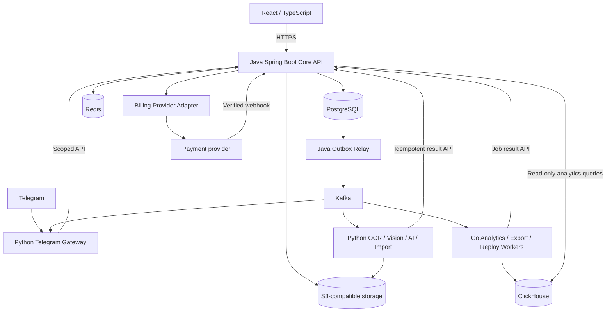

# Finance Bot V1 — план полного rewrite и миграции в SaaS

Дата исходной спецификации: **1 октября 2026 года**. Статус: **активный план V1; приоритеты уточнены 6 октября 2026 года**.

Целевая архитектура утверждена пользователем: **React/TypeScript; Java Spring Boot; Python Telegram/OCR/Vision/AI/import; Go analytics workers/Kafka consumers; PostgreSQL; Redis; Kafka; ClickHouse; полноценная SaaS-монетизация**.

## 0. Обязательное уточнение объёма от пользователя (2026-10-06)

- Текущий релиз — **V1**. Отдельный план улучшенной V2 и работы над V2 отложены до полного завершения V1. Упоминания «v2» ниже в исторических сравнениях или названиях компонентов не расширяют текущий релиз.
- Существующие цели **F01–F60**, требования parity и спецификации остаются без сокращений. Данный приоритет не меняет их смысл и не объявляет незавершённые цели выполненными.
- В ближайшем коротком цикле приоритет — проверяемый **MVP для личного использования**: один доступный извне сервер на ПК пользователя и Android-клиент, которым можно пользоваться постоянно. Ориентир пользователя — 1,5 часа; это временной лимит, не разрешение снизить критерии качества или выдавать незавершённую работу за готовую.
- Android: минимум **API 23 (Android 6.0)**. Приложение должно собираться, устанавливаться и запускаться на доступных эмуляторах Android 6–8; поддержка остальных устройств проверяется отдельно. UI RU/EN покрывает весь согласованный набор продуктовых разделов. Действия без backend-поддержки явно недоступны или показывают состояние разработки; фиктивные успешные ответы запрещены.
- Android и Web должны использовать настраиваемые HTTPS URL публичного API и OIDC issuer. Emulator-only `10.0.2.2`, `localhost` и HTTP разрешены только в явной локальной debug-конфигурации; production release не должен зависеть от этих адресов.
- Публичный доступ не требует проброса портов роутера и не должен менять его настройки. Предпочтительный путь для сервера на этом ПК — HTTPS-публикация через [Tailscale Funnel](https://tailscale.com/docs/features/tailscale-funnel) при проверенных политике доступа, TLS и аутентификации приложения. Funnel доступен всему Интернету; телефону не требуется вступать в tailnet. Если Funnel или другой безопасный публичный HTTPS путь не подтверждён, публичную доступность отметить BLOCKED; не объявлять локальный сервер доступным извне.
- ПК пользователя может оставаться включённым. Требуются автозапуск backend после перезагрузки, восстановление после падения, постоянное хранилище, health check, понятные логи и перезапуск backend после каждого прошедшего проверки изменения. Запрет сна разрешён только при питании от сети и применяется лишь при необходимости; текущие настройки ПК не менять без технической причины. Доступность зависит от питания, Интернета и состояния самого ПК.
- Регистрация открыта. Требуются email + пароль, подтверждение email, повторная отправка подтверждения и восстановление пароля. Подтверждение должно отправляться реальным почтовым провайдером; локальное письмо-заглушка или отключение проверки не принимаются как production решение. SMTP/API пока нет, домен в Cloudflare требует внешней активации DNS; до готовой доставки писем этот критерий остаётся BLOCKED, остальные независимые цели продолжаются.
- Скриншот Cloudflare от пользователя подтверждает создание Worker Build из GitHub для репозитория `finance-bot`, но на нём указаны ветка `main`, корень `/` и `npx wrangler deploy`. Такой экран сам по себе не доказывает публикацию текущей ветки `feat/saas-rewrite`, запуск Java/PostgreSQL или работоспособность backend. Не менять DNS/NS или настройки сети на основании одного статуса Build.
- Все изменения кода выполнять в строгом цикле: **сначала осмысленный тест → запуск и фиксация RED → минимальное изменение → тесты → исправление при необходимости → полный GREEN → релевантная регрессия → проверка артефакта → прогресс и отдельный commit цели → следующая цель**. Зелёный тест, который не проверяет нужное поведение, не является приёмкой.
- Операционная конфигурация, секреты, HTTPS, аутентификация, арендаторы и изоляция данных входят в MVP-критерии. Нельзя открывать финансовые API анонимно, публиковать секреты, отключать firewall или пробрасывать роутерные порты ради скорости.

Детальные этапы, acceptance criteria, внешние зависимости и формат отчёта MVP зафиксированы в [`docs/specs/PERSONAL_MVP_PLAN.md`](docs/specs/PERSONAL_MVP_PLAN.md).

## 1. Цель, границы и основание анализа

Полностью переписать приложение, перенести весь существующий пользовательский функционал и данные, заменить Tkinter веб-интерфейсом, сохранить Telegram и довести продукт до продаваемого SaaS. Старый код служит источником поведения и тестовых эталонов. Он не становится скрытым основным backend новой системы.

### 1.1. Зафиксированный исходник

- Репозиторий: [d3c0r1x/finance-bot](https://github.com/d3c0r1x/finance-bot).
- Ветка: `main`; проверенный снимок: [`cfaa013e1c977db24d7ab81944d0113ca79daea9`](https://github.com/d3c0r1x/finance-bot/tree/cfaa013e1c977db24d7ab81944d0113ca79daea9).
- `VERSION`: `1.1.0`. Версия файла не заменяет commit SHA: функциональность фиксируется по SHA.
- В снимке **85 файлов**, **67 Python-файлов**, **19 377 строк Python**, **698 операторов `assert`**. Последнее число не является числом тестов или показателем покрытия.
- Выполнены инвентаризация всего дерева, разбор AST всех Python-файлов, анализ точек входа, обработчиков, сервисов, SQL, UI, тестовых сценариев и документации. Полный файловый реестр приведён в приложении A.
- Дополнительно проверены изолированными вызовами функции формирования банковских операций и суммирования категорий, а также выражение обработки отсутствующих итогов PDF.
- Полный runtime-прогон приложения, OCR на реальных чеках, интеграции Telegram/Ollama и нагрузочные тесты **не выполнялись**. Здесь определён план, а не отчёт о готовности v1 или v2.
- Реальная `data/finance.db`, фотографии, пользовательский `receipt_samples.json`, действующие секреты и внешняя конфигурация не входят в публичный репозиторий. Проверить полноту конкретной пользовательской базы можно только на этапе пробной миграции.
- Анализ относится ко всему дереву указанного commit, а не к истории всех веток, PR, issues или содержимому рабочего компьютера владельца.

### 1.2. Что означает «сохранить от А до Я»

1. У каждого действующего сценария есть запись в матрице parity, новый владелец и приёмочная проверка.
2. Сохраняются суммы, даты, происхождение данных, пользовательские решения, отключённые подсказки, цели и история. Переносятся не только пять SQL-таблиц, но и смысл ключей `settings`.
3. Telegram сохраняет сценарии, включая отмену, повтор, уточнения и ручную правку. Веб получает функциональный эквивалент всех вкладок Tkinter.
4. Известные ошибки не становятся требованиями. Для них создаётся реестр намеренных изменений с ожидаемым результатом и объяснением расхождений.
5. Перенос возможностей и коммерческая упаковка разделены: существующий пользователь не теряет доступ к своей истории из-за появления тарифов.
6. «Полный rewrite» допускает чтение frozen v1 в тестовом oracle и повторное использование обезличенных fixtures. Производственная реализация пишется заново, в том числе Python-сервисы, с новыми контрактами и границами ответственности.

### 1.3. Уже принято и что остаётся предложением

**Принято:** стек, полный rewrite, весь функционал, Telegram + web, SaaS, family, billing, high-load и учебная прозрачность.

**Предложено этим планом:** модульный Java backend вместо множества Java-микросервисов; OIDC; S3-совместимое хранилище файлов; денежная модель; конкретные API/events; тарифная матрица; SLO; порядок этапов. Это рабочие решения, а не утверждение, что пользователь уже согласовал все детали.

**До публичных платежей нужно определить:** страну продавца и рынок, валюты оплаты, платёжного провайдера, реальные цены, налоги/чеки/договоры, регион данных, бюджет инфраструктуры и модель поддержки. Они не блокируют разработку core и billing sandbox, но блокируют live launch. Юридические требования устанавливаются отдельно под выбранный рынок.

## 2. Что действительно есть в v1

### 2.1. Устройство приложения

`bot.py` запускает aiogram polling, SQLite, обработчики и APScheduler. `panel.py` открывает Tkinter. Бот использует `database/db.py`, панель — отдельный синхронный `database/panel_data.py`. Часть вычислений общая в `services/`, но пути записи разделены. AI работает через локальный или настроенный удалённый Ollama. Изображения читает независимая цепочка Vision + Tesseract + арифметическая сверка.

Сейчас нет полноценного web API, PostgreSQL, Kafka, Go, Java, ClickHouse, SaaS-регистрации, тарифов, платёжного backend, tenant isolation или CI для нескольких языков. Банк поддержан конкретным парсером **PDF «Справка о движении средств» Т-Банка**. Универсального банковского импорта нет. Регулярные платежи обнаруживаются в истории; это не система автоматического списания денег.

### 2.2. Матрица функций и переноса

Обозначения: **J** — Java Core; **P** — Python; **G** — Go; **W** — React. G рассчитывает производные аналитические данные по версии спецификации; J владеет пользовательскими решениями и записью business state. Каждый `Fxx` — обязательная строка будущего `feature-parity.yaml` и тестовый идентификатор.

| ID | Текущая функция и источник | Новый владелец / реализация | Приёмка parity |
|---|---|---|---|
| F01 | Запуск, меню, `/start`, `/menu`, `/help`; `bot.py`, `handlers/main_menu.py` | P Telegram gateway; J dashboard; W главная | Все команды отвечают; нижнее меню возвращается после операций; старую menu button можно заменить |
| F02 | Whitelist и роли из `config.py`, `utils/filters.py` | J identity/membership; P проверяет привязку перед каждым сценарием | Незнакомый пользователь не читает финансовые данные; legacy owner/partner перенесены |
| F03 | Onboarding: имя, доход, пропуск, назад, бюджет, повторная настройка; `handlers/onboarding.py` | J profile/onboarding; P/W пошаговая форма | Повторная настройка не удаляет транзакции; пользователь с историей не считается новым |
| F04 | Имя из Telegram, своё имя, план дохода, статус onboarding; `services/profile.py` | J user profile + tenant member profile | Собственное имя не затёрто синхронизацией Telegram |
| F05 | Свободный текст расхода/дохода/платежа; `ai/llm.py`, `handlers/expenses.py` | P extraction/AI, J validation и подтверждение draft | «Такси 2 тыс», «1,5к», «2 000», запятая, неверный JSON, отключённая модель |
| F06 | Карточка подтверждения, сумма, категория, подкатегория, быстрые суммы, отмена | J drafts; P keyboards; W transaction form | До подтверждения нет финансовой записи; устаревшая кнопка безопасна |
| F07 | Добавление дохода и источника операции | J transactions; P/W ввод | Доход не попадает в расходы/лимиты; сохраняются description/source/date |
| F08 | История последних операций, повтор траты, отмена последней; `main_menu.py` | J repeat/reverse; P/W history | Повтор создаёт новую запись один раз; отмена ограничена доступной пользователю операцией |
| F09 | Desktop CRUD, фильтры user/period/type/search, правка даты, удаление | J transactions API; W таблица | Все доступные поля и фильтры перенесены; правка долга выполняет корректную компенсацию |
| F10 | Фото чека, прогресс, draft; `expenses.py` | J receipt job; P OCR worker; W upload/review | Длительный job показывает статус; повтор update не создаёт второй job |
| F11 | Vision: подготовка фото, строгий JSON, выбор модели/тега, повторный проход | P Vision adapter и resource scheduler | Локальная/удалённая модель, fallback, timeout, недоступная VRAM; видна фактическая модель |
| F12 | Tesseract/OpenCV: варианты, координаты, колонки, склейка чисел, reread ячеек | P OCR pipeline | Синтетические обычные/узкие/наклонные чеки; стабильный порядок параллельных результатов |
| F13 | Сведение Vision/OCR, подтверждение one-to-one, добор, арифметика | P extraction reconciliation; J финальная денежная валидация | Одна OCR-строка не подтверждает два товара; расхождения и происхождение видны |
| F14 | Защита магазина/даты от выдумывания, fallback категории | P evidence extraction; J category policy | Отсутствующее значение остаётся unknown; исходное чтение доступно для проверки |
| F15 | Правка/удаление/добавление позиций, страницы по 8, сумма по позициям | J receipt draft/items; P/W review editor | Любая позиция доступна; кассовый итог не меняется незаметно; явное действие sync total |
| F16 | Возможный дубль чека: та же сумма/тип за 10 минут, решение пользователя | J duplicate candidates + идемпотентность | Два независимых чека на одинаковую сумму можно подтвердить; повтор запроса не дублирует запись |
| F17 | Продуктовый/досуговый чек, доля алкоголя/развлечений, ручная смена | J versioned category policy; P извлекает признаки | Границы 10% алкоголя / 25% досуговых позиций зафиксированы fixtures; ручной выбор сохраняется |
| F18 | Разбор корзины: verdict/reason/action, очистка повторов, правила поверх модели | P генерирует предложение; J применяет каталог правил и сохраняет версию | Нет выдуманных денежных итогов; `rule/model/default/unknown` различаются |
| F19 | Сохранение verdict/advice/verdict_source по позициям | J receipt reviews с item ID | Советы не съезжают при одинаковых названиях; неизвестное старое происхождение не объявляется rule |
| F20 | «Не согласен» с вердиктом, пагинация спорных строк | J user decisions; P/W controls | Товар исключён из необязательного; решение отменяемо и действует везде одинаково |
| F21 | Повторные предупреждения о необязательном товаре; `services/advice.py` | G history features; J policy/presentation DTO | Новый чек не находит сам себя в прошлой истории; разрешённый товар не предупреждается |
| F22 | Семейные и личные месячные лимиты, общий лимит, reset | J budgets с наследованием | Личный override только своей категории; reset возвращает семейный, family report использует family limit |
| F23 | Бюджет по доходу: 70%, округление; AI-предложение при ≥30 днях | J proposal policy; P AI proposal | Предложение не применяется без действия человека; контекст содержит только разрешённые данные |
| F24 | Алерты 90%/100%, остаток, прогноз месяца, темп | J точные текущие суммы и budget policy | 0 означает отключённый лимит; долг не считается обычным расходом; корректны декабрь/февраль |
| F25 | Недельный food limit и скользящие 7 дней; `services/forecast.py` | J food budget; G исторический темп | Лимит работает без длинной истории; одинаковые значения в dashboard, digest и report |
| F26 | «Безопасно тратить»: план/доход, резерв 10%, зарплата, обещанные списания | J cash planning; G recurring projection | Просроченная зарплата не горизонт; без данных нет выдуманного числа; подписки учитываются до горизонта включительно |
| F27 | Общие долги: карточки, остаток, ставка, минимум, погашение, закрытие | J debts; P/W screens | Платёж и изменение долга атомарны; повторное сообщение не уменьшает долг дважды |
| F28 | Правка остатка долга через панель, возврат при отмене платежа | J debt adjustment/reversal | Сохраняется audit; отменяется фактическое изменение, включая погашение сверх остатка |
| F29 | Прогноз погашения с процентами; `services/analytics.py` | J debt calculator | 0 при закрытом долге; null при недостаточном платеже/горизонте >600 месяцев; оценка подписана |
| F30 | Месяц, неделя, 90 дней, произвольный период, family report, доли выходных | J reporting API; G длинные выборки | Фильтры/границы дат идентичны для web/Telegram; доходы и debt payments отделены |
| F31 | Графики категорий, лимитов, дней, цен, необязательного | W charts; P PNG renderer из готового DTO | Данные одни; при недоступном renderer остаётся текст; экспорт PNG читаем |
| F32 | Ежедневная сводка и недельный digest; `scheduler.py`, `digest.py` | J durable schedules/outbox; P доставка | Настраиваемое местное время; retries; один логический выпуск; нет сводки с фиктивными нулями |
| F33 | Цены: единичная цена, сопоставление товара, медиана, рост/дешевле | G price projection; J query API | Новый чек не входит в собственную baseline; разные упаковки/бренды не сливаются автоматически |
| F34 | Каталог после 3 покупок, поиск `/price`, история, лучший магазин | G product projection; P/W catalog | Поиск доступен и для одной покупки; график при ≥2; каталог и поиск имеют разные пороги |
| F35 | Покупки по ритму, медиана интервалов, стоимость списка | G shopping candidates; J personal policies | ≥3 покупки; устаревшие товары исчезают после двух обычных интервалов; это не учёт запасов |
| F36 | «Уже купил», mute/unmute, блокировки, копирование закупки | J shopping decisions; W clipboard; P buttons | Отметка не создаёт расход; устаревает; скрытое перечислено с причиной |
| F37 | Личная инфляция по корзине, окно 90 дней, top rise/fall | G inflation worker; J/P/W выдача | ≥3 товара; ≥2 покупки до окна и ≥1 внутри; вес — прежние траты, не официальная инфляция |
| F38 | Регулярные расходы/доходы, недельные/месячные серии | G recurring worker; J read model | ≥3 повторов, диапазон сумм/интервалов, предупреждение за 3 дня, просроченные не upcoming |
| F39 | Отключение/возврат серии; `services/mutelist.py` | J preferences по user+tenant+section | Отключение не удаляет расход и не затрагивает другого пользователя |
| F40 | Сумма/доля необязательного, источники verdict, исправленные позиции | G advice analytics; J decisions overlay | Знаменатель — разобранные позиции; неизвестные verdict не превращаются в neutral evidence |
| F41 | «Не брать», отдельные догадки модели, подтверждение/разрешение | J decisions и policy; G evidence groups | Model-only догадка не скрывает покупку и не становится целью без решения человека |
| F42 | Пересчёт старых verdict по текущим правилам и отчёт изменений | J explicit recalculation job; G пакетная подготовка | Только явный запуск; старый/новый verdict и причина сохранены; суммы чеков неизменны; сохранённые запуски доступны владельцу с keyset-пагинацией (20 запусков, до 100 позиций на странице); обработка ограничена 50 000 позициями |
| F43 | Потолок экономии, недельный trend, эффект советов по частоте | G advice worker; J query | Не выдавать оценку за факт экономии/причинность; учитывать пересчёты отдельно |
| F44 | Цель на товар или группу, count/sum, кандидаты, минимальный шаг | J goals; G candidate features | 30 дней от принятия; одна активная legacy-цель; новая единица не переписывает обещание |
| F45 | Ход цели, заметка при покупке, завершение, история, следующий кандидат | J lifecycle; G progress inputs | Закрытие один раз; архив переживает снятие цели; legacy история до 24 записей переносится вся |
| F46 | Однократное сообщение исхода цели после успешной отправки | J notification intent + delivery result; P send | При сбое итог не теряется; граница неопределённой внешней доставки документирована |
| F47 | PDF Т-Банка: операции, даты, merchant/card, сверка итогов | P document import; J staging/validation | Valid/mismatch/unverifiable различаются; неверный формат и PDF без текста объяснены |
| F48 | Preview импорта, подтверждение, покупки/доходы/refund, skipped | J import policy; W/P preview | Видны включённые/пропущенные типы и суммы; комиссии не исчезают под неверной подписью |
| F49 | Дедупликация импорта, bulk insert, undo именно партии | J import batches/idempotency | Повтор файла/перекрывающаяся выписка/повтор refund; undo не затрагивает чужие/поздние записи |
| F50 | Категории merchant: правила, AI batches, кэш, уточнения/гипотезы | J merchant mappings; P classification; W/P clarification | Личные соответствия переживают рестарт; уточнения по умолчанию до 6, порог 300 RUB |
| F51 | Уточнение магазина меняет ранее импортированные подходящие записи | J preview/apply reclassification | Список затрагиваемых ID проверяется по tenant/user; не менять ручные правки молча |
| F52 | CSV Excel: UTF-8 BOM, `;`, русские поля, фильтры; `services/export.py` | J export contract; G large export; W download | Совместимый legacy формат и безопасные строки; текущая точка входа — панель, не Telegram |
| F53 | Вкладки Tkinter: обзор, транзакции, чеки, бюджет, пользователи, товары, аналитика, экспорт | W routes/components; J единое API | Восемь вкладок имеют эквиваленты; refresh/F5, переход к тратам пользователя, правка профиля |
| F54 | Статус Ollama/Vision/Tesseract; `services/health.py` | P health; J sanitized status; W/P settings | Пользователь видит доступность функций, оператор — диагностику без секретов |
| F55 | Локальный AI, cloud opt-in, fallback без Ollama, управление моделями | P provider adapters; deployment config | Self-hosted локально без стороннего AI API; внешний inference только настроенный режим |
| F56 | Проверки receipt inventory, synthetic/private samples, CI | P evaluation tools; polyglot CI | `--vision`, `--strict`, `--json` сохранены в новом CLI; private samples не входят в CI artifacts |
| F57 | Русское форматирование, escaping Telegram, шрифты, текстовый fallback | P/W presentation libraries; J semantic DTO | Кириллица, Markdown-символы, суммы/склонения, длинные строки, разные ОС |
| F58 | Конфигурация/секреты/Windows launch scripts/документация/MIT | Infra + docs + dev scripts | Запуск Windows/Linux документирован; лицензионные уведомления сохранены; секреты не в образах |

### 2.3. Расхождения, которые нельзя копировать молча

| ID | Наблюдение в исходниках | Решение v2 и доказательство |
|---|---|---|
| D01 | [`bank_import.py::_row`](https://github.com/d3c0r1x/finance-bot/blob/cfaa013e1c977db24d7ab81944d0113ca79daea9/handlers/bank_import.py#L165) сохраняет bank expense отрицательным; `analytics.by_category` складывает как есть | Единый положительный amount + type. Изолированный пример: manual +100 и bank −100 дают 0 в v1. В v2 расходы 200; расхождение ожидаемо и внесено в reconciliation |
| D02 | Refund импортируется как отрицательный income; `_op_key` и `_existing_keys` используют различные знаки refund | Явный `refund`, positive amount, отдельная fingerprint; не применять `abs` ко всем income без классификации |
| D03 | [`bank_statement.py`](https://github.com/d3c0r1x/finance-bot/blob/cfaa013e1c977db24d7ab81944d0113ca79daea9/services/bank_statement.py#L208): распаковка `expense_total/income_total` падает, если один результат `None` | Три состояния сверки; no-total fixtures. Ошибка выражения воспроизведена изолированно; это не end-to-end PDF-тест |
| D04 | `Statement.expense_ok/income_ok` допускают 1 RUB, а summary обещает «копейка в копейку» | Явный tolerance и фактическая delta в UI; legacy tolerance сохраняется в режиме сравнения, production текст не обещает точность сверх проверки |
| D05 | `_split` исключает не только internal/withdrawal, но и fee/transfer_out; текст объясняет только переводы и снятия | Перечислять каждую исключённую категорию; сохранить legacy preset, добавить явный выбор включения как новую возможность |
| D06 | [`handlers/debts.py`](https://github.com/d3c0r1x/finance-bot/blob/cfaa013e1c977db24d7ab81944d0113ca79daea9/handlers/debts.py#L15) не устанавливает AccessFilter; `bot.py` не добавляет общий auth middleware | Это статическое расхождение с SECURITY.md, а не проверенный exploit. В v2 deny-by-default, включая все callbacks и служебные endpoints |
| D07 | `panel_data.update_transaction` меняет поля без компенсации старого debt payment | J единая транзакционная команда; тест смены amount/type/debt и обратного действия |
| D08 | `MAX(0, balance-payment)` при платеже и прибавление полного payment при undo могут завысить остаток | Хранить applied principal отдельно; ограничить/явно оформить переплату; undo восстанавливает точное before state |
| D09 | Старые даты смешивают SQLite UTC defaults и локальные строки без timezone | Хранить raw date, provenance и явное правило конвертации; неоднозначное помещать в migration review |
| D10 | Нет отдельной receipt entity и надёжного FK от транзакции к фото; часть OCR metadata только в FSM | Создать receipts/documents. Не выдумывать связи изображений или происхождение; unlinked files остаются доступным архивом |
| D11 | SQL-история местами ограничена 500/2000 строками | В v2 полная пагинация и явные окна. Устранение обрезания может менять аналитику; отдельно сравнивать legacy-limited/full-history |
| D12 | README упоминает pytest/tests, реальный CI запускает три корневых скрипта | До переноса запускать именно `smoke_test.py`, `handlers_test.py`, `receipt_test.py`; затем разложить их по нормальным test suites |

Эти изменения входят в rewrite. Они не дают права без отчёта переписывать пользовательскую историю. Мигратор сохраняет исходные значения и журнал преобразований.

## 3. Целевая архитектура

### 3.1. Границы сервисов



Стрелки показывают направление запросов/данных, не разрешение произвольного доступа. Python/Go не получают запись в основные business tables PostgreSQL. Redis не хранит единственный экземпляр денег, пользовательских решений, job state или billing entitlement.

### 3.2. Почему Java Core — модульный backend

Один Spring Boot deployable с явными модулями: `identity`, `tenancy`, `profiles`, `transactions`, `debts`, `budgets`, `receipts`, `imports`, `products`, `advice`, `goals`, `reporting`, `notifications`, `billing`, `audit`, `jobs`.

Модули общаются через application interfaces и внутренние события. Запрещены чужие repository imports. Проверять границы архитектурными тестами; Spring Modulith — кандидат для автоматизации этих проверок, а не обязательное превращение каждого модуля в отдельный сервис. Такой подход поддерживается [Spring Modulith](https://docs.spring.io/spring-modulith/reference/).

Это позволяет атомарно сохранить платёж, изменение долга и событие. Выделять отдельный Java-сервис только при измеримой потребности в независимом масштабе, доступности или владении командой.

### 3.3. Кто за что отвечает

| Компонент | Отвечает | Не владеет |
|---|---|---|
| React | Формы, маршруты, доступность, отображение, загрузка, статусы jobs | Денежные правила, права, лимиты тарифа |
| Java Core | Auth, tenant, business commands, валидация, PostgreSQL, approvals, quotas, billing | OCR inference и тяжёлый массовый scan истории |
| Python Telegram | Telegram protocol, FSM UX, привязка, сообщения, PNG rendering | SQL business tables, самостоятельная запись трат |
| Python intelligence | OCR, Vision, AI suggestions, форматные парсеры, model lifecycle | Утверждение финансовой записи и пользовательских запретов |
| Go workers | Kafka consumption, проекции, batch analytics, экспорт, rebuild | Изменение долга, тарифа, авторизации или цели по собственной инициативе |
| PostgreSQL | Подтверждённые данные, настройки, jobs, outbox, audit, quotas | Ненужное хранение больших файлов в строках |
| ClickHouse | Восстановимая аналитическая проекция | Балансы, финансовые записи, права доступа как source of truth |
| Redis | Кэш, rate limit, короткое состояние диалога, оптимизация | Единственный счётчик платных использований или durable queue |
| Object storage | Исходные документы, безопасные производные файлы, exports | Решение, кому файл разрешено читать |

### 3.4. Владение алгоритмами без расхождения четырёх языков

- J определяет политику: какие операции учитывать, кто их видит, какие verdict действуют, когда разрешено применить результат.
- G выполняет утверждённые аналитические алгоритмы: медианы, интервалы, inflation, long-window aggregation. Формулы и golden fixtures хранятся в `contracts/analytics/` с `algorithm_version`.
- Python извлекает факты и предлагает текст. Категория/вердикт от модели — вход для J, а не окончательное решение.
- W и P показывают один `ReportDTO`. Никаких отдельных подсчётов business totals в React или Telegram.
- Для синхронного остатка бюджета J использует PostgreSQL. Для исторических оценок отдаёт G projection с `as_of`, `input_version`, `algorithm_version`, `completeness`.
- Если recurring projection устарела, «безопасно тратить» не показывает уверенное число. Показывает состояние обновления либо ограниченную оценку с явным объяснением.
- Frozen Python v1 используется только как тестовый эталон для корректных сценариев. Ошибочные сценарии сравниваются с D01–D12, а не с багом как ожидаемым результатом.

## 4. Monorepo и стек разработки

```text
finance-platform/
  apps/web/                         React + TypeScript + Vite
  services/core/                    Spring Boot, Gradle wrapper
    src/main/java/.../              модули из раздела 3
    src/main/resources/db/migration/ Flyway
  services/python/
    telegram_gateway/
    intelligence/                   extraction, OCR, Vision, AI
    document_import/
    report_renderer/
    shared/                         transport, schemas, telemetry
    tests/
  services/workers-go/
    cmd/analytics-consumer/
    cmd/projection-rebuilder/
    cmd/export-worker/
    internal/                       consumers, algorithms, storage
  contracts/
    openapi/                        public и internal contracts
    events/                         JSON Schema + examples
    analytics/                      формулы, versions, golden fixtures
    exports/                        CSV format versions
  packages/api-client-ts/            generated client
  packages/ui/                       общие React-компоненты
  tools/migration-v1/                extract, validate, load, reconcile
  tools/evaluation/                  receipt inventory, AI eval
  tests/parity/                      F01–F58, legacy oracle fixtures
  tests/e2e/                        Playwright + Telegram fake server
  tests/load/                       k6, pgbench, Go replay generator
  infra/compose/                    profiles, init, healthchecks
  infra/deploy/                     IaC, deployment manifests
  infra/observability/              dashboards, rules, collector
  docs/adr/                         решения и их последствия
  docs/runbooks/                    incident, backup, restore, replay
  docs/learning/                    разборы вертикальных срезов
  docs/migration/                   mappings, manifests, reconciliation
  .github/workflows/
  .env.example
  README.md
  LICENSE
```

Frontend: React Router, TanStack Query, типизированный API client, единая библиотека форм/валидации, charts library после небольшого prototype. Серверная валидация обязательна независимо от frontend schema.

Backend: Spring Web, Security, Validation, JDBC/JPA по ADR; для критичных сумм, отчётов и batch — явный проверяемый SQL. Flyway владеет схемой. Python: aiogram, типизированные DTO, pytest, адаптер Ollama/Tesseract/pypdf. Go: стандартный context, ограниченные worker pools, Kafka/ClickHouse clients после проверки совместимости.

На этапе E0 фиксируются поддерживаемые версии Java/Spring, Node, Python, Go и всех images, lockfiles и digest. Не использовать плавающий `latest`. Номер «самой новой версии» здесь намеренно не является требованием: совместимость проверяется общей build matrix.

## 5. Данные PostgreSQL

### 5.1. Общие правила

- ID новых сущностей — UUID; Telegram ID — отдельный `bigint`, не business primary key.
- Все tenant-owned таблицы имеют `tenant_id NOT NULL`. Ссылки проверяются составным FK `(tenant_id, entity_id)`, чтобы нельзя было связать объект другого tenant.
- `occurred_at timestamptz` — время операции; `created_at` — время записи; `updated_at`, `version` — контроль правок. Для дат без времени сохраняются `local_date` и `time_precision`.
- В API деньги — десятичная строка и currency. В PostgreSQL — `numeric(20,2)` для RUB settlement, суммы всегда конечные и положительные, тип задаёт направление. Если вводятся валюты с другой точностью, шкала определяется currency metadata отдельной миграцией/ADR.
- Количество `numeric(18,6)`, цена единицы `numeric(20,6)`, оплаченная сумма строки `numeric(20,2)`. Нельзя проверять `qty*price=sum` без учёта скидки и округления.
- Не складывать разные currency. Первый production scope — RUB; новые валюты являются расширением, а не существующей функцией.
- `version` для optimistic locking; audit с before/after для корректировок. Пользовательское удаление финансовой записи реализуется как void/reversal с исключением из текущих отчётов; privacy erasure имеет отдельный физический lifecycle.

### 5.2. Основные сущности

| Таблицы | Существенные поля и инварианты |
|---|---|
| `users`, `external_identities`, `auth_sessions` | subject, verified email, Telegram ID, status; уникальность provider+subject; без финансовых данных глобально |
| `tenants`, `memberships`, `invitations` | personal/family, timezone, currency, role, status, invite expiry; один active owner минимум |
| `member_profiles` | display_name, planned_income, onboarding_state, goal_unit; отдельные предпочтения в каждом tenant |
| `accounts` | name, kind, currency, owner/scope, opening_balance; для legacy — synthetic account «Legacy / не распределено» |
| `categories`, `subcategories` | stable code, name, active; стартовые 10 категорий v1; архивирование не ломает историю |
| `transactions` | tenant, owner_user, account, type, amount, currency, category, subcategory, description, source, occurred_at, status, version, import_batch_id, legacy_id |
| `debt_accounts`, `debt_entries` | initial/current amount, APR, minimum, status; payment/adjustment/reversal, applied_principal, transaction_id; изменение остатка атомарно с entry |
| `budget_policies`, `budget_limits` | scope family/member, period monthly/rolling7, category/total, amount, effective_from, origin; отдельная семантика food rolling7 |
| `documents` | tenant, uploader, storage_key, hash, MIME, bytes, scan_state, retention, original_name; закрытый bucket |
| `receipts`, `receipt_items` | document_id nullable, transaction_id nullable unique, draft/status, cash_total, items_total, merchant, receipt_date, item ordinal, qty, price, line_sum, evidence |
| `receipt_readings`, `receipt_reviews` | reader/model/prompt version, raw_result reference, field provenance, confidence, mismatch; verdict/advice/source и история версий |
| `import_batches`, `import_rows` | checksum, parser/version, totals/status, counts; ordinal, original signed amount, kind, fingerprint, exclusion reason, mapped transaction |
| `merchant_mappings` | tenant+user+normalized merchant, category, label, decision source/version; user choice сильнее AI |
| `product_aliases` | tenant+user, legacy product key, normalized key, version; миграция identity не теряет mute/goal |
| `user_product_decisions`, `muted_suggestions`, `shopping_marks` | allowed/confirmed, section, product/series key, marked_at; отдельная таблица вместо произвольных JSON settings |
| `goals`, `goal_outcomes` | target/product/group, unit, baseline snapshot, target value, start/end, status, outcome, announced_at; unique outcome per goal |
| `recalculation_runs`, `recalculation_changes` | initiator, algorithm versions, before/after verdict, affected items, aggregate delta; воспроизводимость и отмена решения |
| `notification_preferences`, `notification_intents`, `delivery_attempts` | channel, local schedule, report period, unique intent key, status, provider message ID |
| `jobs`, `job_attempts` | type, owner, input revision, state, retry, lease, deadline, result reference, cancellation |
| `outbox_events`, `inbox_events` | unique event_id, aggregate/version, payload schema, published_at; inbox уникален по consumer+event_id |
| `plans`, `plan_versions`, `prices`, `subscriptions`, `billing_events` | коммерческий каталог, provider IDs, interval/currency, lifecycle, effective plan version |
| `entitlements`, `usage_reservations`, `usage_ledger` | feature, quota period, reserved/consumed/released, unique operation ID; атомарный контроль |
| `audit_log`, `idempotency_records`, `migration_id_map`, `legacy_raw_records` | actor/action/trace; request key/hash/result; source checksum + table + old ID; зашифрованный legacy audit |

Производные аналитические результаты могут храниться в `analytics_snapshots` PostgreSQL для небольших карточек, но только через J result API. ClickHouse остаётся основным хранилищем тяжёлых проекций.

### 5.3. Денежные правила

Типы: `expense`, `income`, `refund`, `debt_payment`, `transfer`, `adjustment`. `amount > 0`; `refund` может ссылаться на оригинальную покупку, но связь не выдумывается при импорте.

Для периода: `net_expense = expense − refund`, `cashflow = income + refund − expense − debt_payment`; внутренний transfer не меняет общий cashflow. Платёж долга не попадает в расходы категории «еда». Остаток account учитывает движения только своего account. Legacy balance «доход минус траты» называется именно показателем периода, а не банковским остатком.

Пример: покупка 100 RUB, возврат 25 RUB, доход 1 000 RUB, платёж долга 200 RUB. Расход net = 75 RUB; cashflow = 725 RUB. Этот fixture проходит J API, G projection, W, Telegram и CSV.

`debt_payment` в v1 — упрощённое уменьшение долга, не полноценный банковский график principal/interest. В v2 сохраняется режим ручного учёта. Реальное начисление процентов не включается автоматически из прогноза.

### 5.4. Индексы и изоляция

Основные индексы: transactions `(tenant_id, owner_user_id, occurred_at DESC, id DESC)`, `(tenant_id, type, occurred_at)`, receipt_items `(tenant_id, receipt_id, ordinal)`, imports `(tenant_id, owner_user_id, fingerprint)`, outbox pending index, jobs `(state, next_attempt_at)`. Partial unique index обеспечивает одну active goal на member для legacy режима. Fingerprint хранит version; коллизии и одинаковые легитимные операции требуют review, а не слепого удаления.

RLS — дополнительный барьер поверх проверки membership. DB-role приложения не должна обходить RLS; tenant context устанавливается внутри транзакции через `SET LOCAL`, а не навечно в pooled connection. Отдельно тестируются table owner и privileged roles: в PostgreSQL они могут обходить политики. Основание: [PostgreSQL row security](https://www.postgresql.org/docs/current/ddl-rowsecurity.html).

## 6. API: контракт, а не доступ к таблицам

### 6.1. Общий контракт

Public REST: `/api/v1`. Tenant-owned endpoints: `/api/v1/tenants/{tenantId}/...`. Tenant из URL всегда сверяется с membership текущего subject; `userId` из body не означает право действовать за него.

- OpenAPI — источник generated clients. JSON UTF-8, timestamps RFC 3339, денежные строки.
- Cursor pagination по `(occurred_at,id)`, default 50, max 200; стабильные sort keys.
- POST mutations: `Idempotency-Key`, уникальность `(tenant, actor, route, key)`; тот же key с другим body hash возвращает conflict. Durable business uniqueness не зависит от истечения HTTP-key TTL.
- PATCH: `If-Match`/version; конфликт возвращает 409/412 и актуальную revision.
- Errors: `application/problem+json` с `code`, `traceId`, `fieldErrors`; без stack trace/SQL.
- Async: 202 + `jobId`, `Location`; `GET jobs/{id}`, SSE status с reconnect, polling fallback. Статус доступен только инициатору/уполномоченному tenant actor.
- Измеримые deadlines, rate limits, максимальные размеры; `429` с `Retry-After`.

### 6.2. Группы endpoints

Пути ниже относительны tenant prefix, кроме auth/me.

| Группа | Методы/пути | Поведение |
|---|---|---|
| Identity | `/auth/login`, `/auth/callback`, `/auth/logout`, `GET /me`; `POST /me/telegram-link` | OIDC session и одноразовая привязка Telegram |
| Tenant | `POST /tenants`; `GET/PATCH /`; `GET/POST /members`, `POST /invitations`, `DELETE /members/{id}` | Создание, приглашение, роли, выход/передача владения |
| Profile | `GET/PATCH /profile`, `POST /profile/onboarding/reset` | Имя, план дохода, timezone, настройки |
| Transactions | `GET/POST /transactions`, `GET/PATCH /transactions/{id}`, `POST /transactions/{id}/void`, `/repeat` | Финансовая команда с audit; повтор не копирует чужой receipt ID |
| Drafts | `POST /transaction-drafts`, `PATCH /transaction-drafts/{id}`, `POST /transaction-drafts/{id}/confirm` | Text extraction и ручная карточка; duplicate candidate token |
| Accounts/categories | `GET/POST/PATCH /accounts`, `/categories`, `/subcategories` | Новые account capabilities и сохранённые категории |
| Debts | `GET/POST /debts`, `PATCH /debts/{id}`, `POST /debts/{id}/payments`, `/adjustments`, `GET /debts/{id}/forecast` | Весь расчёт остатка внутри J |
| Budgets | `GET/PUT /budgets`, `DELETE /budgets/personal-overrides`, `POST /budget-proposals`, `/budget-proposals/{id}/apply` | Общий/категорийный/rolling7 scope; apply versioned |
| Documents | `POST /uploads`, `POST /uploads/{id}/complete`, `GET /documents/{id}/download` | Scoped signed URL после проверки размера/типа/доступа |
| Receipts | `POST /receipts`, `GET/PATCH /receipts/{id}`, `POST/PATCH/DELETE /receipts/{id}/items`, `/sync-total`, `/confirm` | Item ID в пути PATCH/DELETE; явное согласование сумм |
| Imports | `POST /imports`, `GET /imports/{id}/preview`, `PATCH /imports/{id}/rows/{rowId}`, `POST /imports/{id}/commit`, `/undo` | Preview revision закреплена; conflict при устаревшей версии |
| Merchant | `GET/PUT /merchant-mappings`, `POST /merchant-reclassifications/preview`, `/apply` | Список affected IDs и сохранение личного правила |
| Reports | `GET /dashboard`, `/reports/month`, `/reports/period`, `/reports/family`, `/reports/digest`, `/reports/{id}/chart` | Один семантический DTO; period/timezone/currency/as_of |
| Products | `GET /products`, `/products/search`, `/products/{id}/history`, `/shopping`, `POST /shopping/{id}/bought` | Каталог, поиск, clipboard-ready list |
| Preferences | `PUT/DELETE /suggestions/{section}/{id}/mute`, `PUT /products/{id}/decision` | Идемпотентные allowed/confirmed/muted |
| Analytics | `GET /analytics/inflation`, `/recurring`, `/waste`, `/effects`, `/savings`, `/trends` | Значения + evidence/completeness, null при недостатке данных |
| Advice/goals | `POST /advice-requests`, `POST /review-recalculations/preview`, `/apply`; `GET/POST /goals`, `POST /goals/{id}/cancel`, `GET /goals/history` | Подтверждённые действия отделены от предложений |
| Export | `POST /exports`, `GET /exports/{id}` | Format version, filters, snapshot watermark, expiring download |
| Settings | `GET/PATCH /notification-preferences`, `GET /service-status` | Расписание, quiet hours, доступность без инфраструктурных секретов |
| Billing | `GET /billing/plans`, `/billing/subscription`, `/billing/usage`; `POST /billing/checkout`, `/portal`, `/cancel` | Только owner/billing_admin; checkout не даёт entitlement до подтверждения |

Billing webhook — отдельный `/webhooks/billing/{provider}`. Telegram webhook — Python endpoint. Internal endpoints `/internal/v1/jobs/{id}/result`, `/notifications/{id}/delivery`, `/analytics/snapshots`, `/migration/batches` защищены service identity и узкими scopes, не публичным JWT пользователя.

### 6.3. Пример транзакции

```json
{
  "type": "expense",
  "amount": "320.50",
  "currency": "RUB",
  "categoryCode": "food",
  "description": "Продукты",
  "occurredAt": "2026-10-01T12:30:00+03:00",
  "source": "manual",
  "accountId": "<uuid>"
}
```

Ответ содержит `id`, `version`, подтверждённые денежные значения и текущий budget summary из PostgreSQL. Server не доверяет присланному `source` для привилегированных каналов: `bank`, `migration`, `telegram` проставляет соответствующий доверенный маршрут.

### 6.4. Минимальные state machines

- Draft: `editing → awaiting_confirmation → confirmed | cancelled | expired`.
- Receipt job: `uploaded → scanning → queued → extracting → needs_review → confirmed`; альтернативы `failed/cancelled`. При ошибке extraction документ можно обработать вручную.
- Import: `uploaded → parsed → needs_review → ready → committing → committed → reverted`; failed commit не виден как частично подтверждённая партия.
- Goal: `active → completed | cancelled`; outcome создаётся один раз, `announced_at` отдельно.
- Notification: `pending → sending → delivered | retryable | failed | delivery_unknown`.

Каждый переход проверяет actor, tenant, текущую version и допустимость состояния. Результат старого OCR job не перезаписывает уже отредактированный пользователем draft.

## 7. Kafka: события, доставка и восстановление

### 7.1. Event envelope

```json
{
  "event_id": "<uuid>",
  "event_type": "transaction.updated",
  "schema_version": 1,
  "tenant_id": "<uuid>",
  "aggregate_type": "transaction",
  "aggregate_id": "<uuid>",
  "aggregate_version": 4,
  "occurred_at": "2026-10-01T09:30:00Z",
  "recorded_at": "2026-10-01T09:30:01Z",
  "producer": "core",
  "traceparent": "<w3c-trace-context>",
  "correlation_id": "<request-or-job-id>",
  "payload": {
    "owner_user_id": "<uuid>",
    "type": "expense",
    "amount": "320.50",
    "currency": "RUB",
    "category_code": "food",
    "status": "posted"
  }
}
```

Payload для проекции содержит полное текущее состояние необходимых полей. `recorded_at` — время события, `occurred_at` финансовой записи не используется как версия. Исправление старой покупки может прийти сегодня. Event key: `tenant_id:aggregate_id`. Для per-user analytics consumers используют отдельные keyed recomputation tasks; порядок между разными aggregate не предполагается.

### 7.2. Каталог topics

Начальные partitions ниже — параметры стенда, не доказанная production ёмкость. Для production replication factor 3 и min ISR 2, если выбрана трёхузловая инфраструктура; local Compose использует 1/1.

| Topic | Producer / consumer | Events или command payload | Key / partitions / retention |
|---|---|---|---|
| `finance.transactions.v1` | J / G analytics | created, updated, voided; полный state + version | tenant:transaction / 12 / 30 дней |
| `finance.receipts.v1` | J / G price/advice | confirmed, item_changed, review_changed, deleted | tenant:receipt / 12 / 30 дней |
| `finance.preferences.v1` | J / G recompute, P cache invalidation | budget, product decision, mute, profile, membership changes | tenant:entity / 6 / 14 дней |
| `finance.debts.v1` | J / G reports | payment, adjustment, reversal, closed | tenant:debt / 6 / 30 дней |
| `finance.goals.v1` | J / G reports, notifications logic in J | accepted, cancelled, completed | tenant:goal / 6 / 30 дней |
| `jobs.receipt-extract.v1` | J / P OCR pool | job_id, input_revision, document reference, pipeline version | tenant:job / 6 / 7 дней |
| `jobs.document-import.v1` | J / P import pool | job_id, parser, document reference | tenant:job / 6 / 7 дней |
| `jobs.ai-assist.v1` | J / P text inference | job_id, context reference, purpose, policy version | tenant:job / 6 / 7 дней |
| `jobs.analytics.v1` | J / G batch | recompute scope, watermark, algorithm_version | tenant:user / 12 / 7 дней |
| `jobs.export.v1` | J / G export | export_id, authorized scope, snapshot watermark, format | tenant:job / 6 / 7 дней |
| `notifications.delivery.v1` | J / P delivery | intent_id, template/DTO reference, destination reference | tenant:user / 6 / 7 дней |
| `billing.entitlements.v1` | J / cache invalidation consumers | plan/entitlement revision, effective date | tenant / 3 / 30 дней |
| `privacy.lifecycle.v1` | J / G + P | deletion request, erase generation, affected subject | tenant:subject / 3 / 30 дней, без исходных финансов |
| `<topic>.dlq` | Consumer / operator replay tool | origin topic/partition/offset, error code, event reference, attempts | original key / как source / 14 дней |

Первый вариант не требует topic на каждого tenant. Kafka ACL разделяют producers/consumer groups; пользователь не подключается к Kafka. Фото, PDF, bearer tokens и полные AI prompts не передаются в сообщении. Worker получает краткоживущий доступ к object по job identity. Retention уточняется по требованиям удаления и storage budget; это не срок хранения финансовой истории.

### 7.3. Outbox, idempotency, retry

1. J в одной PostgreSQL transaction меняет business state, резервирует usage при необходимости и пишет outbox.
2. Relay читает outbox с lease/row lock, публикует с `acks=all` и idempotent producer, затем отмечает отправку. Падение после publish, до отметки допускает повтор того же event ID.
3. Consumer проверяет schema/version и делает идемпотентный side effect. Offset подтверждается только после durable результата. Нельзя записать «обработано» перед записью результата.
4. Для business результатов P/G вызывают J result API с `(job_id,input_revision,result_digest)`; J атомарно проверяет lease/revision, сохраняет результат и пишет своё следующее событие.
5. transient retry: backoff с jitter и deadline, по умолчанию 5 попыток. Невалидная схема и permanent errors идут в DLQ без бесконечного цикла.
6. Для ordered aggregate processing retry не должен молча переупорядочивать mutations. Consumer проверяет версии, игнорирует старый state, запускает snapshot repair при пропусках.
7. DLQ alert содержит безопасную ссылку, не персональный payload. Replay выполняется scoped operator job, сохраняет event ID, причину, who/when и audit.

Kafka transaction сама по себе не делает атомарной запись в PostgreSQL или ClickHouse. План использует at-least-once delivery и идемпотентные эффекты; не обещает end-to-end exactly-once. Основание: раздел delivery semantics в [Apache Kafka design](https://kafka.apache.org/41/design/design/).

### 7.4. Эволюция схем и replay

JSON Schema в `contracts/events`; nullable/optional additions совместимы, удаление/смена смысла поля требует новой major schema/topic и окна совместимости. CI проверяет old producer/new consumer и наоборот на fixtures. Запрещено переиспользовать enum со старым названием для нового смысла.

Replay старых событий не запускает повторные платежи, OCR или рассылку: analytics rebuild использует отдельные consumer groups и отключённые side effects. Job commands при replay сверяются с durable job registry и terminal status.

После истечения Kafka retention проекции восстанавливаются из согласованного PostgreSQL snapshot плюс событий после его watermark. Для больших данных создаётся versioned snapshot export и migration/rebuild manifest; одной надежды на «в Kafka всё осталось» недостаточно.

## 8. Go workers и ClickHouse

### 8.1. Рабочие процессы

| Worker | Вход | Выход | Особые гарантии |
|---|---|---|---|
| Transaction projection | transaction/debt events | Версионные факты ClickHouse | Повтор и изменение категории/даты не задваивают деньги |
| Receipt/product projection | receipts/items/reviews | Цена единицы, product evidence, данные для catalog | Стабильная legacy identity; ручные corrections создают новую revision |
| Analytics worker | user recompute job | Recurring, inflation, shopping candidates, advice trends/effects | Один input watermark; алгоритм и полнота явно указаны |
| Goal calculation worker | goal + history snapshot | Progress/evidence proposal | J закрывает цель только после проверки актуальности и собственной policy |
| Export worker | authorized export job | CSV в object storage + result metadata | Stable snapshot; streaming; без загрузки всей истории в RAM |
| Projection rebuilder | PostgreSQL snapshot + event tail | Новая generation аналитики | Контрольные суммы; переключение active generation после сверки |

Не создавать отдельный deployable на каждую формулу. Сначала один Go analytics binary с независимыми consumer groups и модулями; отдельно rebuild/export из-за иного memory/CPU профиля.

Concurrency ограничена на процесс, partition и tenant. Использовать `context` deadlines, bounded channels, graceful shutdown, retries без busy loop, metrics для queue age. Большой tenant не должен занимать весь pool. Горизонтальный масштаб ограничен числом partitions и пропускной способностью sink; рост goroutines сам по себе не доказывает high-load.

### 8.2. Алгоритмы, которые нужно специфицировать до переписывания

- Product identity: `product_key`, `same_product`, нормализация `ё/е`, цифр/упаковки/бренда; aliases сохраняют старые user decisions. Изменение алгоритма не переклеивает товары автоматически.
- Price: `line_sum/qty` с проверкой qty; обычная цена — медиана; baseline для новой покупки только из предыдущих покупок. Зафиксировать поведение при чётном количестве наблюдений: v1 местами использует верхний средний элемент, а не среднее двух.
- Recurring: ≥3 occurrences; `(max−min) <= average*0.25`; интервалы 6–8 или 25–35 дней; ≥60% интервалов внутри ±25% медианы; предупреждение 0–3 дня. Месячная серия — один платёж, недельная нормализуется к 30 дням.
- Food pace: rolling 7 дней, текущий bucket отдельно, медиана непустых прошлых buckets, минимум 2; alert при +25%. Денежный food limit независим от достаточности истории.
- Inflation: минимум 3 совпавших товара; два старых и один новый observation; окно 90 дней; `index = sum(old_spend * new_median / old_median) / sum(old_spend) − 1` с versioned intermediate rounding.
- Shopping: ≥3 покупок в разные даты; медиана интервалов, horizon и stale rule из v1; купленное скрывается на обычный интервал только если отметка новее последней покупки.
- Advice: доли только среди позиций с verdict; allowed overrides, separate model guesses, подтверждения, пересчёты; эффекты сравнивают частоту и минимально достаточные периоды.
- Goals: fixed 30-day window; count/sum; baseline snapshot; отмена не удаляет outcome; category membership использует границы слов, а не произвольную подстроку.

Для каждого алгоритма: спецификация, набор положительных/отрицательных/пограничных примеров, правила missing data, timezone, сортировки, округления и identity. Все constants извлекаются в versioned policy package. Python `round` и Java `BigDecimal`/Go decimal должны сравниваться на `.5` и промежуточных значениях; случайно сменить rounding mode нельзя.

### 8.3. ClickHouse model

Предлагаемые таблицы: `transaction_versions`, `receipt_item_versions`, `review_versions`, `analytics_snapshot_versions`. Поля: tenant, owner, entity ID, entity version, status/deleted, occurred_at, amount/currency, projection_generation, algorithm version, ingested_at.

Для обновляемых фактов — ReplacingMergeTree(version) с immutable sorting key `(tenant_id, entity_id)` и стабильной partition strategy, например hash bucket tenant. Нельзя partition by изменяемая дата операции: правка даты иначе оставит версии в разных partitions. В production размер buckets выбирается по benchmark, не заранее на миллиарды строк.

Слияние версий фоновое и не гарантирует немедленно правильный SUM. Query layer выбирает latest version (`argMax` с полным tuple или корректный `FINAL`), затем отбрасывает deleted, затем фильтрует изменяемые поля и агрегирует. Нельзя сначала отфильтровать старую category/date и получить устаревшую версию. Поведение ReplacingMergeTree требует query-time учёта дублей: [ClickHouse documentation](https://clickhouse.com/docs/concepts/features/operations/update/replacing-merge-tree).

Не строить денежный SummingMergeTree MV напрямую поверх потока повторяемых CDC/events. Для быстрых daily aggregates создавать snapshots с generation после дедупликации исходных фактов. Update/delete инвалидирует затронутые старые и новые периоды.

Watermark — набор обработанных offsets/versions, а не одна максимальная дата. Rebuild: snapshot S, хвост событий после S, сверка count/sum/hash, atomic switch active generation, сохранение предыдущей generation на rollback window. Отдельный reconciliation job сравнивает PostgreSQL и ClickHouse по tenant/day/currency/type.

Изоляция ClickHouse: доступ только через J query layer, обязательные tenant predicates и query templates; отдельный служебный read role. Browser и Telegram не получают ClickHouse credentials. Tenant deletion проверяется в core немедленно, затем выполняется физическое удаление projections и контроль завершения.

## 9. Python: Telegram, OCR/Vision, AI и документы

### 9.1. Telegram gateway

- Polling для dev/self-hosted; webhook для SaaS, проверка secret header, TLS и дедупликация `update_id`.
- Привязка: пользователь входит в web, получает одноразовый короткоживущий код, подтверждает его в личном чате бота. J связывает Telegram identity с пользователем. Код одноразовый, хранится hash, попытки ограничены.
- При нескольких tenant бот явно показывает выбранное пространство. Переключение очищает/перепривязывает draft; нельзя подтвердить старую кнопку в другом tenant.
- Service credential бота имеет только разрешённые API scopes. Actor context выдаётся J по подтверждённой Telegram binding; произвольный `user_id` в body не принимается.
- FSM UX в Redis с TTL, но существенные drafts/jobs/import batches в PostgreSQL. Потеря Redis не теряет подтверждённую операцию или возможность отмены batch.
- Старые command names и callback scenarios сохранены; callbacks используют opaque entity token + revision, а не доверенный список из клиентского сообщения.
- Ограничения Telegram на длину текста/клавиатуры проверяются; длинные чеки листаются. Markdown escaping остаётся единым helper.
- Retry outbound delivery уважает rate limits. Таймаут после отправки означает `delivery_unknown`: Telegram не даёт универсальной атомарной транзакции с PostgreSQL. Не обещать отсутствие всех внешних дублей; обеспечить один business intent и контролируемый retry.

### 9.2. Receipt pipeline

1. J принимает metadata upload, проверяет membership, размер, тариф, создаёт document/job и usage reservation.
2. Файл поступает в quarantine bucket; MIME проверяется содержимым. Worker не запускается до scan/validation.
3. P выполняет crop/deskew/contrast/variants и независимые OCR/Vision чтения. GPU semaphore ограничивает inference, CPU pool — Tesseract. Текстовая и vision model не выгружают друг друга конкурентно.
4. Reconciliation сохраняет оба чтения, matching one-to-one, поля `observed/recovered/corrected/agreed/manual/unknown`, discrepancy, reader/model/pipeline versions.
5. Worker возвращает draft. J проверяет decimals, структуру, пределы и input revision, но не утверждает достоверность фотографии по одному JSON.
6. W/P показывают кассовый итог, сумму строк, расхождение, происхождение, ручной редактор. Если итог не прочитан, total из позиций помечен как inferred.
7. Confirm создаёт receipt+transaction+items атомарно, outbox event и окончательное usage settlement. Анализ корзины может завершиться позже и не блокирует запись расхода.

Требования: отсутствие Vision оставляет OCR; отсутствие обеих систем оставляет ручной ввод; AI timeout не уничтожает draft. UI не обещает точное время GPU job, но показывает queued/running/needs_review и возможность отменить.

### 9.3. AI boundary

Задачи: text transaction extraction, merchant suggestions, budget proposal, basket narrative, recommendations. Каждый output проходит schema, range, category enum и policy validation. AI не выполняет SQL, не выбирает tenant и не вызывает денежные mutations.

Реестр prompt/model versions и evaluation dataset. Local Ollama — поддерживаемый режим; remote inference — явная deployment/tenant policy, с описанием передаваемых данных. Provider secrets — только server side. В SaaS данные находятся у оператора сервиса; нельзя обещать local-first приватность v1 для hosted варианта. Self-hosted сохраняет локальную обработку после доставки Telegram-файла.

### 9.4. Import service

Первый parser — точный формат v1 Т-Банка. `ParserResult` содержит все найденные операции, исходные суммы со знаком, semantic kind, merchant/card-last4, parsed/expected totals, quality и parse version. P не решает, какие строки станут финансовыми операциями.

J сохраняет staging, показывает included/excluded/duplicates/unverifiable, применяет merchant mappings и подтверждённую политику. `refund` — самостоятельный type. Дедупликация: provider ID при наличии; иначе canonical fingerprint по tenant+account+date+time+currency+signed amount+normalized full description+occurrence discriminator. Не использовать только первые 40 символов; не сливать две легитимные одинаковые покупки без проверки.

Commit batch создаёт строки одним видимым логическим набором. Для больших файлов chunked staging + activation: пока batch не `committed`, его строки не входят в отчёты. Undo voids только собственные строки этой партии; если строка уже изменена, показать конфликт и список, а не отменять чужую работу.

CSV/другие банки/сканированные PDF — дальнейшие parser plugins. Они не объявляются уже существующими возможностями v1.

## 10. React: экраны и UX

| Route | Содержимое | Источник |
|---|---|---|
| `/login`, `/onboarding` | Вход, восстановление, имя, доход, бюджет, Telegram linking | Новый auth + F03–F04 |
| `/dashboard` | Период, расходы/доход, лимит, food week, долги, safe-to-spend, job updates | F01, F24–F26 |
| `/transactions` | Таблица, фильтры, add/edit/repeat/void, import/source labels | F05–F09 |
| `/receipts`, `/receipts/:id` | Фото, распознавание, позиции, происхождение, edit/confirm, verdict dispute | F10–F20 |
| `/imports`, `/imports/:id` | Upload, сверка, skipped, duplicates, merchant clarification, commit/undo | F47–F51 |
| `/budgets` | Family/personal, общий/категорийный лимит, rolling7, proposal/reset | F22–F25 |
| `/debts` | Остаток, ставка, minimum, payment, adjustment, forecast | F27–F29 |
| `/reports` | Месяц/неделя/90 дней/custom/family, графики, digest | F30–F32 |
| `/products`, `/products/:id` | Каталог, поиск, история, медиана, магазин, price chart | F33–F34 |
| `/shopping` | «Пора купить», bought/muted/blocked с объяснениями, copy list | F35–F36 |
| `/analytics` | Inflation, recurring, food pace, waste, effects, trend, savings ceiling | F37–F43 |
| `/goals` | F44 count/sum proposals and accepted 30-day goal; F45 progress/history; F46 one-time outcome delivery | F44–F46 |
| `/assistant` | Запрос рекомендации, объяснение данных, budget/basket proposals | F18/F23 + новая единая оболочка |
| `/accounts` | Счета, валюты в рамках scope, opening balance, transfers | Новое расширение SaaS |
| `/family` | Участники, роли, приглашения, профили, переход к тратам | F53 + новый tenancy |
| `/exports` | Формат, период, scope, статус и скачивание | F52 |
| `/settings` | Profile, notifications, AI policy, service status, data export/delete | F54–F58 + SaaS |
| `/billing` | Тариф, usage, checkout, invoices/provider portal, cancel | Новый billing |
| `/ops` | Jobs/DLQ/health/billing diagnostics, scoped support | Новая операторская зона |

Desktop UI заменяется browser UI, но переносится его назначение. Отдельное native desktop приложение и офлайн-запись с синхронизацией не требуются для parity: это были бы новые продукты. Self-hosted web доступен локально.

Общие состояния: loading, empty, insufficient_history, stale, permission_denied, quota_exceeded, failed, retryable. Данные с задержкой имеют «обновлено на…». Подтверждённый финансовый ответ не подменяется оптимистичным frontend расчётом. Optimistic UI допустим для несущественной визуальной настройки с rollback.

Responsive desktop/mobile, keyboard navigation, focus management, контраст, текстовые альтернативы графиков, русская локаль первой версии. Цифры форматируются с locale, транспортные значения остаются точными строками. Список из миллионов записей не загружается целиком в браузер.

## 11. Auth, RBAC и tenant model

### 11.1. Модель пространства

`User` — человек; `Tenant` — личное/семейное финансовое пространство; `Membership` — роль внутри пространства. Один человек может состоять в нескольких tenant. Подписка SaaS и quotas привязаны к tenant, не к Telegram ID.

В personal tenant — только владелец. Family tenant имеет общие операции и общие долги; пользовательские лимиты, goals, mute и preferences сохраняются отдельно. Предлагаемая первая модель: все финансовые записи family tenant доступны членам по роли; truly private finances ведутся в личном tenant. Не обещать приватные записи внутри общей семьи без отдельной реализации visibility model.

Legacy база с двумя участниками мигрирует в один family tenant. Shared debts и family limits остаются shared. Транзакции сохраняют owner_user. `owner` становится Owner, `partner` — Member; права локальной desktop панели заменяются явной Owner/Admin ролью, не выдаются всем автоматически.

### 11.2. Роли

| Действие | Owner | Admin | Member | Viewer | Billing admin |
|---|---|---|---|---|---|
| Читать разрешённые семейные отчёты | Да | Да | Да | Да | Только если есть отдельная financial role |
| Создать/изменить свои операции | Да | Да | Да | Нет | Нет |
| Изменить операции других членов | Да, audit | Да, audit | Нет | Нет | Нет |
| Общие бюджеты и debts | Да | Да | Читать; платёж по разрешённому долгу | Читать | Нет |
| Личные лимиты/цели/предпочтения | Свои; чужие только явная admin-функция с audit | Аналогично | Свои | Только чтение разрешённого | Нет |
| Пригласить/изменить роль | Да | Ниже Admin, без повышения себя | Нет | Нет | Нет |
| Billing/checkout/cancel | Да | Только с billing permission | Нет | Нет | Да |
| Передать владение/удалить tenant | Да, повторная auth | Нет | Нет | Нет | Нет |

Права задаются permissions, роли — их пакеты. Последнего Owner нельзя удалить. Отзыв membership немедленно блокирует API; кэш permissions имеет revision и короткий TTL, критичные mutations перепроверяют источник.

### 11.3. Вход и сессии

OIDC Authorization Code + PKCE, совместимый identity provider выбирается в E0. Браузер работает через Spring BFF/session: Secure, HttpOnly, SameSite cookie, CSRF protection. JWT применяются на доверенных backend/service границах с проверкой issuer/audience/expiry; refresh secrets не кладутся в localStorage.

Email verification, восстановление, session revoke, rate limiting, MFA для operator/owner-sensitive действий. OIDC subject не равен tenant role: role определяется membership в J. Разделить platform operator и tenant owner. Support access — временный, с причиной и audit, без постоянного чтения всех финансов.

## 12. Billing, plans, limits и монетизация

### 12.1. Две разные сущности «подписка»

`recurring_series` — обнаруженная покупка/платёж пользователя из истории. `billing_subscription` — оплата самого Finance SaaS. Они имеют разные таблицы, API, события, UI и права. Найденная серия Netflix не создаёт billing subscription.

### 12.2. Предлагаемая коммерческая матрица

Числа ниже — начальная гипотеза для unit economics и нагрузочного стенда, не утверждённые цены. Каталог хранится в БД с версиями; hardcode тарифов в React запрещён.

| Возможность | Free | Pro | Family |
|---|---|---|---|
| Участники tenant | 1 | 1 | До 5 |
| Ручной учёт, долги, бюджеты, базовые отчёты, Telegram | Да | Да | Да |
| Просмотр своей сохранённой истории и CSV | Да | Да | Да |
| OCR успешных jobs / месяц | 10 | 200 | 500 общих |
| AI запросов / месяц | 20 | 300 | 800 общих |
| PDF imports / месяц | 2 | 30 | 60 общих |
| Документы в хранилище | 100 MB | 2 GB | 5 GB |
| Price history, inflation, advice effects, goals, advanced analytics | Ознакомление/preview | Да | Да |
| Family roles/совместные budgets | Нет | Нет | Да |
| Приоритет обработки | Обычный | Повышенный в пределах fairness | Повышенный в пределах fairness |

Транзакции не удаляются при downgrade. Блокируется создание новых ресурсоёмких jobs сверх лимита, а просмотр/выгрузка сохраняются. Превышение member quota при downgrade не исключает людей автоматически: вводится grace и owner выбирает дальнейший режим.

Для мигрирующего владельца — entitlement `legacy_full`, сохраняющий все v1-функции в согласованном personal/family tenant. Условия его окончания не придумываются: начальное предложение — бессрочное сохранение v1 parity при обычных технических anti-abuse limits. Новые коммерческие расширения могут иметь отдельный тариф. Self-hosted deployment сохраняет local AI и core parity; модель платной поддержки/обновлений оформляется отдельно с учётом MIT v1.

### 12.3. Реализация billing

- Provider adapter: create checkout/customer portal, verify webhook, fetch subscription state, cancel at period end, reconcile payments, refund/credit workflow, invoices reference.
- Цена: `plan_version`, currency, interval monthly/yearly, amount, provider_price_id, effective dates. До live launch все live price IDs должны быть заполнены и сверены.
- Lifecycle: `trialing`, `active`, `past_due`, `grace`, `cancel_at_period_end`, `cancelled`, `expired`. Успешный redirect checkout не является подтверждением оплаты.
- Webhook проверяет подпись и timestamp по спецификации выбранного провайдера, фиксирует уникальный provider event ID. При повторе — тот же результат. При событиях не по порядку — authoritative state fetch/reconciliation; старый event не возвращает истёкший план.
- Payment failure: понятное уведомление, ограниченный grace, retry по правилам провайдера; после grace сохраняется чтение/экспорт. Refund/chargeback учитываются отдельным workflow, без уничтожения финансов пользователя.
- Trial, coupons, annual plans, prorations и налоговые документы поддерживаются как явные настройки/возможности adapter; бизнес-правила и sandbox cases должны быть утверждены до включения.
- Ежедневная reconciliation сверяет provider subscriptions с entitlement revisions; manual override ограничен сроком, причиной и audit.

### 12.4. Учёт использования

До запуска job J в PostgreSQL атомарно проверяет `consumed + reserved + requested <= limit` и создаёт reservation. Уникальный operation ID исключает повторное списание. Успех переводит reserved в consumed; permanent failure/cancel до полезного результата освобождает reservation. Зависшие reservations закрывает reconciler по job terminal state, а не по одному таймеру.

Период quotas фиксируется в UTC на границах subscription period; UI показывает местную дату. Повторная доставка Kafka, client retry, модельный fallback и повторный HTTP callback не списывают новую единицу. Ручной rerun пользователем — новая операция с явным отображением расхода quota.

Redis rate limits защищают от bursts; платный ledger остаётся в PostgreSQL. Системные затраты логируются отдельно: model tokens, GPU/CPU seconds, storage bytes, egress. Для тарифа считаются revenue, provider fees, inference cost, support и целевой margin. После measurement предлагаемые quotas пересматриваются через новую plan version.

## 13. Observability, SLO и отказоустойчивость

### 13.1. Единая диагностика

OpenTelemetry trace проходит HTTP, Kafka, job, database и provider call. Structured JSON logs: service, environment, trace_id, job_id, error_code, algorithm_version. Не логировать токены, полные чеки/PDF, prompts или финансовые payload по умолчанию. Tenant/user IDs не использовать как высококардинальные Prometheus labels; scoped trace lookup доступен оператору.

Метрики: request rate/errors/duration; connection pools/slow SQL; outbox oldest age; Kafka lag и oldest event age; consumer retries/DLQ; ClickHouse ingestion/freshness; OCR stage duration, fallback rate, mismatch rate; job queue age; billing webhook lag/reconcile discrepancies; quota reservation age; delivery success/unknown; backup age/restore verification.

### 13.2. Начальные цели, подлежащие проверке

| Показатель | Цель production beta | Как измеряется |
|---|---|---|
| Core read/write availability | 99.5% за месяц; GA target 99.9% после проверки инфраструктуры | Успешные валидные запросы / валидные запросы, исключая клиентские 4xx |
| Core API latency | p95 ≤300 ms read, ≤500 ms write; p99 ≤1 s на benchmark profile | Server-side histogram, без OCR/AI времени |
| Analytics freshness | p95 ≤30 s в steady load | Возраст необработанного source event и report watermark |
| Job acceptance | p95 ≤1 s | Upload завершён; исключено время передачи файла |
| OCR latency | Отдельно CPU/GPU/cold/warm; gate назначается по E4 baseline | queue wait + processing, никаких обещаний «30 s» без измерения |
| Backup/recovery | RPO ≤15 min, RTO ≤2 h для GA target | Реальная restore drill с PostgreSQL WAL и files |
| Точность финансовой проекции | Ноль необъяснённых расхождений после catch-up | Reconciliation по tenant/day/type/currency |

Это acceptance targets, не текущие результаты. В начале stages может быть более слабая доступность, но она должна быть явно описана.

### 13.3. Поведение при сбоях

| Сбой | Поведение |
|---|---|
| Kafka недоступна | Core сохраняет transaction+outbox; analytical jobs pending; alert по backlog; admission control при риске переполнения |
| Redis недоступен | Чтение из PostgreSQL, ограниченный fallback rate limit; подтверждённые drafts/jobs не пропадают |
| ClickHouse недоступен | Core money/budget работают; долгие отчёты показывают unavailable/stale, не выдают нули |
| Ollama/Vision недоступны | Rules/Tesseract/manual fallback; модельный timeout не повторяет финансовую запись |
| PostgreSQL недоступен | Записи не подтверждаются; UI показывает retryable failure; никакого «сохранили в Redis потом» |
| Billing provider недоступен | Новая покупка pending; действующие права по последнему подтверждённому state до policy deadline |
| Telegram недоступен | Durable notification retry; web доступен; endpoint не зависит от успешной отправки сообщения |

Alerts имеют owner, severity и runbook. Page только на actionable проблемы; обычный insufficient_history не считается ошибкой.

## 14. Security и приватность

Обязательные границы: tenant isolation, недоверенные документы/AI, сервисные credentials, финансовые mutations, billing webhook, operator support.

- Центральная авторизация для всех маршрутов и callbacks; негативные cross-tenant tests, включая export/job/document download и composite FK.
- HTTPS, ограниченный CORS, CSRF для cookie auth, CSP, escaping пользовательских строк, параметризованный SQL, ограничения query complexity.
- Private object storage: случайные ключи, запрет path traversal, short-lived signed URLs только после auth, безопасный `Content-Disposition`, quarantine/scan, лимиты bytes/pages/pixels, decompression bombs и parser timeout.
- Worker sandbox: non-root, ограниченные CPU/RAM/time/temp storage, минимум network egress, отсутствие shell interpolation имени файла. Uploaded URL не скачивается произвольно: SSRF protection/allowlist.
- AI input — данные, не инструкции. Не исполнять prompt из PDF или текста чека. LLM output не имеет инструментов для прямой записи денег или доступа к секретам.
- Secrets из secret manager, отдельные credentials для dev/stage/prod, rotation, no secrets in image/build logs; secrets scan CI. Service scopes минимальны, machine tokens короткоживущие.
- CSV formula injection: строки с `=`, `+`, `-`, `@` в текстовых колонках экранируются безопасным export policy; числа остаются числами, audit CSV имеет отдельный versioned format.
- Audit фиксирует изменение transaction/debt/budget/role/plan/decision. Не хранить секреты или полные документы в audit. Доступ и retention audit определяются отдельно.
- Backup зашифрован, ключи отдельно. Restore не должен воскресить удалённый tenant без повторного применения erasure manifest.
- Account/tenant deletion: немедленно запретить доступ, остановить jobs/delivery, удалить files/projections/cache, физически удалить персональные business records по принятой retention policy; legally retained billing records отделить от product history.
- Kafka/raw snapshots имеют конечный срок хранения и доступ только backend; replay фильтрует erasure registry, чтобы удалённые субъекты не восстановились из старых событий.
- Сканирование зависимостей/SBOM/образов, лицензии библиотек и моделей, проверка публичного exposure портов. Model weights могут иметь лицензию, отличную от MIT кода проекта.

Публичная документация должна отдельно объяснять hosted и self-hosted обработку, роль Telegram и выбранного AI provider. Условия хранения и удаления утверждаются для реального рынка до запуска, без заявления о compliance только на основании этого плана.

## 15. Стратегия тестирования

### 15.1. Слои проверок

| Слой | Инструмент/подход | Что доказывает |
|---|---|---|
| Legacy baseline | Три существующих скрипта в изолированной среде | Реально работающий baseline; skips записаны отдельно |
| Java unit/property | JUnit + property testing | Money, budgets, debts, transitions, rounding, auth policies |
| PostgreSQL integration | Testcontainers + реальные migrations | Constraints, rollback, locking, RLS, outbox, quotas |
| Python unit/integration | pytest, synthetic receipts/PDF, model stubs | Parsers, fallback, reconciliation, error handling |
| Go unit/property/race | `go test`, race detector, golden fixtures | Algorithms, duplicate/order cases, bounded concurrency |
| Contract | OpenAPI/JSON Schema compatibility, generated clients | Межъязыковой обмен без дрейфа полей/типов |
| Event integration | Kafka + ClickHouse + PostgreSQL | Publish crash windows, duplicate delivery, repair/replay |
| Web E2E | Playwright | Пользовательский сценарий, права, ошибки, mobile и keyboard |
| Telegram E2E | Fake Bot API/dispatcher updates | Все кнопки/команды, старые callbacks, routing order, retries |
| Migration rehearsal | Обезличенные копии SQLite + manifest | Data completeness, repeatability, reconciliation, rollback |
| Security | Negative auth, tenant fuzz, document adversarial fixtures | Нет пересечения tenant и обхода квот/прав |
| AI/OCR eval | Versioned corpus + offline/online lanes | Качество извлечения, fallback, затраты и регрессии |

На PR обязательны детерминированные проверки без Ollama/внешнего API. GPU и real-provider sandbox — отдельные gated lanes. Отсутствие приватных samples должно отображаться как SKIPPED, а не как «OCR проверен на всех реальных чеках».

### 15.2. Parity registry

```yaml
- id: F15
  feature: receipt_item_editing
  legacy_commit: cfaa013e1c977db24d7ab81944d0113ca79daea9
  sources:
    - handlers/expenses.py
    - keyboards/expense_kb.py
  targets:
    - core/receipts
    - python/telegram_gateway
    - web/receipts
  fixtures:
    - long_receipt_17_items
    - missing_cash_total
    - quantity_discount_rounding
  acceptance:
    - all_items_editable
    - explicit_total_sync
    - stale_callback_rejected
  tests: []
  status: planned
  intentional_differences: []
  evidence: []
```

Пустые `tests/evidence` здесь обозначают будущую реализацию. Статус `verified` разрешён только со ссылками на test run, fixture, commit v2 и результат. Registry генерирует отчёт покрытия по F01–F58; новый найденный сценарий добавляет новую строку, а не прячется в комментарии.

### 15.3. Обязательные проверочные сценарии

1. Один пользователь, другой пользователь той же семьи, другой tenant, отозванный member, platform operator без support grant.
2. HTTP timeout после commit; повторный Idempotency-Key; тот же key с новым payload; повтор Kafka event; crash после sink write до offset commit.
3. Покупка/доход/refund/debt payment/transfer; отрицательная legacy сумма; частичный/полный refund; неизвестная связь возврата.
4. Полное погашение, переплата, два конкурентных платежа, edit и undo. Остаток никогда не зависит от того, использовался web или Telegram.
5. Чек: два одинаковых товара, скидка, дробный вес, порванные числа, потерянный итог, строки дороже итога, ложный магазин, ручная правка, duplicate override.
6. Import: нет одного/обоих итогов; итоги не сходятся; 0 income; все строки duplicates; два одинаковых легитимных платежа; перекрывающиеся выписки; повторный refund; undo после правки строки.
7. Дата на границе суток/месяца/года; високосный февраль; timezone migration; rolling7 vs calendar week; late-arriving expense.
8. Product key mismatch, одинаковый бренд с разным объёмом, expired bought mark, model-only guess, allowed/confirmed конфликт, rules version change.
9. Goal начинается 29-го числа, меняется default unit, завершается во время сбоя рассылки, приходит старый progress result, повторяется close job.
10. Billing webhook duplicate/out-of-order/invalid signature; два concurrent OCR на последнюю quota; downgrade при превышении seats; provider outage; refund/chargeback.
11. Rebuild ClickHouse во время новых записей; удаление/смена даты; duplicate event; пропуск версии; erasure и восстановление backup.

### 15.4. Качество OCR/AI

Нужен размеченный consented corpus: минимум 100 разнообразных чеков как стартовый gate, с отдельным holdout; магазины/освещение/ширина/скидки/весовые товары/наклон. Реальные private чеки остаются вне Git. Synthetic corpus в Git нужен для детерминированных регрессий.

Метрики: exact total match, доля корректных line sums, item precision/recall, merchant/date correctness, false duplicate rate, доля needs_review, hallucinated fields, latency/cost по этапам. Сравнивать OCR-only, Vision-only и combined. Арифметически сошедшийся чек не автоматически считается семантически правильным.

Initial gate: отсутствие регрессии относительно зафиксированного v1 на одинаковом corpus и ноль silent confirmations при известном mismatch. Численные пороги точности устанавливаются после baseline, а не придумываются как уже достигнутые. Каждая смена модели/prompt/rules повторяет сравнение и сохраняет отчёт.

## 16. Performance и high-load benchmarks

### 16.1. Воспроизводимый стенд

Два профиля: `dev-smoke` для ноутбука и `reference-load` для измерений. Предлагаемый reference: app host 8 vCPU/16 GB RAM, PostgreSQL 8 vCPU/32 GB RAM/NVMe, analytics host 8 vCPU/32 GB RAM, отдельный load generator. Kafka production topology тестируется отдельно на трёх brokers. GPU OCR стенд описывается отдельно: GPU model/VRAM, model quantization, cold/warm, batch/concurrency.

Это требования к описанию эксперимента, не заказ инфраструктуры. Если бюджет не позволяет такой стенд, взять меньший и честно записать характеристики. Результаты разных машин нельзя выдавать за чистый выигрыш кода.

Генератор seeded: 10 000 tenant, 50 000 user, 1 млн операций для CI-scale и 10 млн для reference-scale, позиции чеков отдельно до 30 млн. Распределение неравномерное: hot tenant, hot category, bursts, разные интервалы, возвраты/правки/удаления. Отдельно сценарий 100 млн как capacity study после прохождения базового, без обещания срока.

### 16.2. Набор экспериментов

| ID | Нагрузка | Предварительный gate |
|---|---|---|
| B01 | 80% read / 20% write, ramp 10→50→100→250 RPS, 30 min plateau | На 100 RPS выполнить API SLO, ошибки server <0.1%; break point зафиксировать |
| B02 | 1 000 concurrent users, hot tenant и cold cache | Нет cross-tenant утечек, bounded memory; p99 и fairness измерены |
| B03 | Import 10k и 100k rows, concurrent read | Нулевые потери/дубли, видимая атомарность batch; throughput и lock time измерены |
| B04 | Kafka 1k events/s в steady state + 10x burst | p95 freshness ≤30 s steady; backlog drain быстрее поступления после burst |
| B05 | Rebuild 10 млн transactions | Суммы/числа совпадают; предварительная цель ≤30 min на reference profile, уточнить после baseline |
| B06 | ClickHouse period/category/price queries, cold/warm | p95 ≤1 s для согласованного набора dashboards; exact-result queries измеряются отдельно |
| B07 | Concurrent debt payments/quota reservations/webhooks | Ноль нарушений balances/quotas; 100 повторов одного event дают один business effect |
| B08 | Kill worker/broker/Redis/CH, network delays, 2h soak | Нет утраты confirmed writes; recovery/retry/DLQ ожидаемы; память не растёт неограниченно |
| B09 | OCR CPU/GPU 1/2/4 concurrent jobs | Точность не падает; queue admission работает; cold/warm latency и cost опубликованы |
| B10 | Полный экспорт большой истории | Streaming memory bound; данные snapshot стабильны; отмена освобождает ресурсы |

RPS — offered load и achieved throughput указываются раздельно. Для k6 использовать arrival-rate workload и учитывать dropped iterations; процентиль только успешных ответов не должен скрывать провалы. pgbench проверяет DB primitives, но не заменяет API benchmark.

### 16.3. Обязательный отчёт до/после

Для каждой оптимизации: commit, dataset seed/size/hash, hardware, container limits, versions, schema/indexes, warmup 5 min, минимум 3 одинаковых прогона, p50/p95/p99, error rate, CPU/RAM/I/O, SQL plans, locks, cache hit, Kafka lag, CH query profile, цена ресурса.

Порядок: измерить baseline; найти bottleneck; изменить одну обоснованную вещь; повторить профиль; проверить денежную корректность. Нельзя добавлять Redis ради красивой диаграммы или называть Go high-load без измеренных throughput и восстановления после сбоя.

## 17. Docker Compose и среда разработки

### 17.1. Profiles

| Profile | Состав | Назначение |
|---|---|---|
| `core` | PostgreSQL, Redis, OIDC dev realm, object storage, Java, web | Первый рабочий вертикальный срез |
| `async` | Kafka KRaft, topic init, Go workers, ClickHouse | События, проекции, imports/jobs |
| `python` | Telegram gateway, intelligence/import worker, Tesseract с `rus` | Telegram и документы |
| `ai-local` | Ollama или документированное подключение host Ollama | Локальная inference; GPU mapping отдельно |
| `observability` | OTel Collector, Prometheus, Grafana, trace/log backend | Полная диагностика |
| `billing-sandbox` | Provider stub/webhook simulator | Детерминированная разработка платежей |
| `full` | Все необходимые SaaS-компоненты | E2E и migration rehearsal |

S3-compatible dev image выбирается по поддержке и лицензии в ADR, production может использовать managed object storage. OIDC local realm содержит только демонстрационные данные.

Будущий стандартный запуск:

```bash
docker compose --env-file .env.dev -f infra/compose/compose.yml --profile core up --build
docker compose --env-file .env.dev -f infra/compose/compose.yml --profile full up --build
```

Это целевые команды будущего monorepo; файлов Compose пока не создано. Скрипты `dev.ps1` и `dev.sh` проверяют Docker, ports, secrets и готовность сервисов. README даёт Windows/WSL2 и Linux пути без ручной правки кода.

### 17.2. Контракт окружения

- `.env.example` содержит названия и безопасные демонстрационные значения: PG, Redis, Kafka bootstrap, CH, S3, OIDC issuer/client, bot token, Ollama endpoint/model, billing sandbox keys, timezone.
- Secrets не попадают в tracked `.env.dev`; Infisical остаётся поддерживаемым способом доставки секретов.
- Healthchecks проверяют готовность зависимостей; init jobs для schema/topics/buckets идемпотентны. `depends_on` не заменяет application retry.
- Persistent volumes для DB/files/broker; отдельная явно разрушительная команда reset только для dev. Обычный запуск не сбрасывает данные.
- Database/Kafka/ClickHouse ports по умолчанию не публичны; dev host bindings — localhost.
- Resource limits и profiles позволяют работать без GPU и без всей observability; модель не скачивается заново при каждом старте.
- Seed содержит два tenant и разные роли для isolation tests, synthetic transactions/receipts; никаких настоящих телефонов, токенов или чеков.

## 18. CI/CD и доставка

### 18.1. Pipeline

1. **PR:** formatting/lint/types, Java/Python/Go/TS unit tests, architecture rules, secrets/dependency/license scan, schema compatibility, changed-area integration tests.
2. **Required integration gate:** PostgreSQL/Kafka/Redis/ClickHouse ephemeral environment, cross-service contracts, business invariants, RLS, critical F01–F58 flows. Он не пропускается только потому, что path filter не увидел зависимый consumer.
3. **Main:** полная детерминированная parity suite, E2E web+Telegram, build immutable images, SBOM, vulnerability gate, signed artifacts.
4. **Staging:** schema expand migration, deploy, smoke, sandbox billing, migration rehearsal на разрешённом fixture, focused load smoke.
5. **Release:** release manifest с image digests/schema/event versions, backup check, canary core/worker, health/SLO check, rollout либо rollback.
6. **Scheduled:** full load, GPU eval, dependency updates, restore drill и tenant erasure/replay tests с заданной периодичностью.

Публикация image использует OIDC workload identity, если выбранная платформа поддерживает; long-lived registry secrets избегаются. Production secrets недоступны PR из fork. Cache не содержит customer datasets.

### 18.2. Миграции и rollback deploy

Schema changes — expand/contract: сначала совместимые nullable columns/indexes/API, затем backfill, затем новый reader/writer; удаление старого поля только после окна совместимости. Flyway migration запускается отдельным job с single-owner lock. Rollback образа не откатывает destructive DDL автоматически.

Kafka consumer rollout поддерживает старую/новую schema в объявленном окне. Нельзя deploy producer нового enum раньше consumers, если они его не умеют. Feature flags независимы от тарифов: entitlement даёт право, flag управляет rollout.

### 18.3. Production topology

Для beta: reverse proxy/TLS, минимум два core instance при заявлении HA, отдельные worker pools, PostgreSQL backups/PITR, object storage, monitored Kafka/CH. Если всё стоит на одной VM, это честно обозначается как single-node beta, без обещания HA.

Для GA: managed или обслуживаемые с restore drills PostgreSQL/Kafka, репликация по выбранному failure model, worker autoscaling по lag/queue age, отдельные CPU/GPU pools, IaC environments, private networking, zero-trust service identity, tested deployment rollback. Kubernetes выбирается только при реальной операционной готовности; это не условие самого использования четырёх языков.

## 19. Миграция данных v1

### 19.1. Mapping таблиц и файлов

| Источник | Назначение | Правило |
|---|---|---|
| `users.telegram_id/name/role/registered_at` | users, external_identities, memberships, profiles | Сохранять Telegram bigint, deterministic UUID map; дополнять пользователей из transactions/settings/config |
| `transactions.*` | transactions + legacy_raw_records | Сохранять original row; нормализовать знаки/типы по D01/D02; не терять subcategory, source, description |
| `transactions.debt_target` | debt entry link | Stable map старых `sber/tbank/yandex/main`; неизвестный ID — review, не fake debt |
| `debts.*` | debt_accounts + opening reconciliation entry | Сохранить current balance как исходный authority; не проигрывать старые payments поверх него повторно |
| `receipt_items.*` | receipts/items/reviews | Synthetic receipt для transaction; сохранить qty/price/sum/verdict/advice/verdict_source; null source остаётся unknown |
| `settings.*` | Typed tables по разделу 19.2 + raw archive | Каждый ключ accounted: migrated/known obsolete/quarantined; никаких молчаливых drops |
| `data/receipts/*` | documents/object storage | SHA-256, MIME, bytes, original filename; связь только при доказательстве, иначе unlinked archive |
| `.env`/Infisical/config | Deployment config/identity mapping | Секреты не входят в migration CSV/report; legacy user whitelist и defaults сверяются отдельно |
| `receipt_samples.json` | Private evaluation corpus manifest | Только при предоставлении владельцем; не выкладывать реальные файлы в Git |

Схема v1 не имеет currency/account, поэтому RUB и synthetic legacy account — явное migration assumption. Это не доказательство реального банковского остатка. Общие долги не раскладываются произвольно между пользователями.

### 19.2. Mapping settings

| Legacy key | Новая сущность / поведение |
|---|---|
| `limit:{category}`, `limit:total` | Family budget policy |
| `limit:{telegram_id}:{category}`, `limit:{telegram_id}:total` | Member overrides; отсутствие отличается от explicit 0 |
| `profile:{id}:name`, `:income`, `:onboarded` | Profile name, planned income, onboarding completion |
| `food:week:{id}` | Member rolling7 food budget; не смешивать с monthly |
| `recurring:muted:{id}` | Muted series со старым stable key/alias |
| `shopping:muted:{id}` | Muted product reminders |
| `shopping:bought:{id}` | Product key + mark date; сохранение срока по legacy rules |
| `advice:allowed:{id}` | Explicit allowed product decisions |
| `advice:confirmed:{id}` | Confirmed bans; конфликт allowed/confirmed разрешается тем же precedence, что v1 |
| `advice:recalc:{id}` | Recalculation summary/history record, без повторного выполнения |
| `advice:goal:{id}` | Active/closed goal record, started_at, fixed unit/target, announcement state |
| `advice:goal_history:{id}` | Goal outcomes; перенести все сохранённые записи и ограничения legacy history |
| `advice:goal_unit:{id}` | Default unit preference; не менять unit текущей цели |
| `advice:goal_category:{id}` | Ключ объявлен в коде; обрабатывать только если реально присутствует, не считать отдельную заполненную сущность доказанной |
| `bank_merchants:{id}` | Merchant mappings с legacy source и без приписывания AI/user provenance, если оно неизвестно |
| Неизвестные ключи | Encrypted legacy archive + blocking review для значимых настроек |

До импорта сканируются реальные ключи и возможные старые схемы по `PRAGMA table_info`. Нельзя судить о версии базы только по файлу `VERSION`.

### 19.3. Правила сложных преобразований

**Деньги.** SQLite REAL читается с сохранением исходного представления; нормализация через decimal из текстового значения, с explicit rounding policy и отчётом каждой ненулевой rounding delta. Negative bank expense становится positive expense. Negative bank income рассматривается как candidate refund только при подтверждённом legacy source/rule. Необычные отрицательные ручные записи требуют review.

**Даты.** У миграции есть `legacy_timezone`, подтверждённая по реальному deployment, а не автоматически взятая из timezone этого чата. Значения с offset интерпретируются по offset. Наивные даты сохраняют raw и выбранное правило; legacy UTC defaults и local inserts разбираются по доступному provenance. Если provenance отсутствует, назначается uncertainty и требуется review для записей на границах отчётных периодов.

**Долги.** Начальный остаток v2 равен проверенному текущему остатку v1. Старые payments импортируются как исторические связанные операции без повторного decrement. Adjustment/reconciliation entries объясняют отличие initial-current от суммы payments; четыре демонстрационных долга не удаляются автоматически, пока владелец не определил их статус.

**Фото.** В исходной схеме нет надёжной связи file↔transaction. Filename/date/amount могут дать candidate match, но не authority. Неоднозначное остаётся unlinked, позиции и transaction всё равно мигрируют.

**Identity.** Стабильные product keys, muted series и goal references получают legacy aliases. Новая нормализация не уничтожает пользовательские решения. Неизвестные users из history создаются как inactive/unclaimed profile с сохранённым legacy ID, а не присваиваются owner.

**Состояния диалогов.** Несохранённый FSM v1 может жить только в памяти. В cutover пользователям предлагается закончить/отменить draft, затем старые незавершённые сообщения помечаются устаревшими. Невозможно восстановить отсутствующее в snapshot состояние задним числом; это явно фиксируется в manifest.

### 19.4. Пробный перенос

1. Сделать consistent SQLite backup с учётом WAL через SQLite backup API или после остановки writers. Обычная копия одного `.db` при активной записи недостаточна.
2. Снять manifest: source SHA/version, schema, checksum базы, counts/min/max dates/sums, список файлов/hashes, settings keys, конфигурационные defaults без секретов.
3. Запустить extractor read-only. Выгрузить staging bundle с raw и normalized полями, deterministic migration IDs, validation/quarantine report.
4. Проверить orphan receipt_items, неизвестных users/debts, дубли ID, invalid money/dates, malformed settings, missing files. Ничего не исправлять молча.
5. Загрузить в пустой staging tenant через выделенный J migration API с audit и отключёнными рассылками/billing effects. Backfill отправляет projection events, но не notifications.
6. Повторить загрузку того же manifest: новых business records должно быть 0. Затем restart посередине: итог идентичен непрерванной загрузке.
7. Построить G/CH projections и reconciliation. Человек получает понятный отчёт changed/unchanged/quarantined.

Мигратор — отдельный инструмент с правами только на migration endpoints. Offline bulk loader допустим лишь как контролируемый компонент Java-владельца схемы; Python extractor не получает постоянный production write password.

### 19.5. Что сверяется

| Объект | Gate |
|---|---|
| Users/transactions/receipt items/debts | source count = migrated + explicitly quarantined; quarantine для обязательных данных перед cutover = 0 |
| Суммы | Совпадение по user, type, category, day/month и currency после опубликованных normalization rules |
| Legacy vs corrected totals | Отдельные колонки raw-v1, normalized-v2, delta, reason Dxx; нет необъяснённых delta |
| Долги | Current balance в точности совпадает с подписанной исходной сверкой, historical payments не применены дважды |
| Settings | Каждый key accounted; personal/family precedence, 0/null, mute/allowed/goal state сохранены |
| Файлы | Каждый файл migrated либо явно excluded с причиной; bytes/hash совпадают; orphan links не выдуманы |
| Goals/decisions | Смысл и даты сохранились, нет повторного outcome или самовольного recalculation |
| API/CH | Согласие на одинаковом watermark после catch-up; не только global total, но tenant/user breakdown |

### 19.6. Cutover: один writer

1. Убедиться, что F01–F58 verified, приняты Dxx, migration rehearsal и restore drill прошли.
2. Объявить короткое окно записи; остановить **и Telegram v1, и desktop panel, и scheduler**. Проверить отсутствие фоновых writers.
3. Снять финальный backup+manifest, выполнить финальный import/delta по стабильной карте IDs. Legacy во время переноса read-only.
4. Сверить данные и smoke сценарии до открытия записи v2. Старые scheduled messages отключены; новый scheduler стартует с явной точки.
5. Переключить Telegram polling/webhook только на один экземпляр владельца update stream. Проверить pending updates и их dedup keys. Веб v2 открывается после сверки.
6. Ограниченный pilot, мониторинг money reconciliation/errors/lag, затем все legacy users. Старый UI сообщает о read-only архиве.
7. Сохранить encrypted v1 snapshot и migration report на согласованный rollback window; затем применять retention policy.

Не использовать прямой dual-write из бота сразу в SQLite и PostgreSQL. Для shadow сравнения v1 остаётся writer, а v2 получает только снимки/согласованные read-only exports без внешних side effects. Это сложнее live replication, зато не создаёт две конкурирующие истины.

### 19.7. Rollback без потери новых записей

**До первых v2 writes:** отключить v2, вернуть v1 snapshot/bot/scheduler, отменить routing. Это простой проверяемый rollback.

**После v2 writes:** старый snapshot уже устарел. Запретить новые записи, сохранить v2 backup и delta journal, попытаться восстановить v2 предыдущим совместимым релизом. Возврат к v1 допустим только после проверенного обратного mapping delta для всех использованных типов и восстановления сумм. Новые SaaS-only entities не помещаются в v1: их нельзя потерять ради быстрого rollback. Если reverse conversion не доказана — read-only режим и roll-forward repair.

Проверить этот сценарий на rehearsal: создать операции после cutover, вызвать rollback процедуру, доказать ноль потерь. Фраза «есть backup» сама по себе не удовлетворяет этому gate.

## 20. Feature-parity checklist для переключения

Все пункты ниже пока **не выполнены**: это приёмочный checklist будущей реализации.

- [ ] F01–F04: меню, onboarding, profiles, roles и привязка Telegram.
- [ ] F05–F09: text/manual transactions, income, draft edits, history/repeat/undo и desktop CRUD.
- [ ] F10–F17: фото, два читателя, fallback, reconciliation, позиции, duplicate confirmation, category policy.
- [ ] F18–F21: basket review, сохранённые verdict/source, human disagreement, повторные предупреждения.
- [ ] F22–F26: family/personal budgets, proposals, 90/100 alerts, food week, safe-to-spend.
- [ ] F27–F29: debts, payment, adjustment/reversal, forecast.
- [ ] F30–F32: все reports/charts/digest и scheduled delivery.
- [ ] F33–F39: prices/catalog/search/shopping/inflation/recurring/mute.
- [ ] F40–F46: waste/ban/model guesses/recalculation/effects/savings/goals/history/outcome delivery.
- [x] F47–F51: T-Банк parser, preview, commit, dedup, undo, merchant clarifications и reclassification.
- [ ] F52–F58: CSV, все вкладки панели, health, local AI, evaluation, formatting, launch/docs/license.
- [ ] У каждого Fxx есть web/Telegram проверки для соответствующих интерфейсов; неприменимое явно объяснено.
- [ ] D01–D12 отражены в fixture expectations и reconciliation report; исправления не названы случайной потерей parity.
- [ ] Каждый старый файл отражён в приложении A; новые найденные функции добавлены в registry.
- [ ] Реальная SQLite база и все предоставленные файлы прошли полный mapping, включая unknown settings review.
- [ ] Snapshot, restore, cutover, rollback-before-write и rollback-after-write проверены.
- [ ] Пользователь может выполнить свои прежние сценарии в v2 без скрытого обращения к v1 backend.

## 21. Этапы разработки и учебные результаты

Этапы — gates, а не обещание календарного срока. Четыре языка и полноценный SaaS для одного разработчика требуют последовательной работы; оценка по неделям появляется после первых двух срезов и измерения темпа. Не переносить auth/security/telemetry целиком «на потом».

| Этап | Результат и работы | Definition of Done этапа | Что разработчик должен уметь объяснить |
|---|---|---|---|
| E0. Baseline и контракты | Зафиксировать v1, прогнать исходные тесты, F registry, D fixtures, version matrix, ADR foundations | Детерминированный baseline с понятными skips; все 85 файлов accounted; первая OpenAPI и schema | Чем поведение отличается от реализации; почему исправление бага меняет oracle |
| E1. Core vertical slice | PostgreSQL, Flyway, Java modules, minimal auth+tenant, transaction create/list/void, outbox skeleton | 2 tenant isolation tests; деньги decimal; idempotency; Docker core запускается | Как HTTP доходит до transaction, почему DB transaction атомарна, как работает индекс |
| E2. Web и профиль | React, login/onboarding, dashboard, filters, transaction form/history, profile | F03–F09 для web; E2E через настоящий API; ошибки/empty/permissions | Client/server validation, query cache, session/CSRF, почему UI не source of truth |
| E3. Budgets и debts | Полные budgets, food limit, debt lifecycle, basic reports, draft policy | F22–F25/F27–F30; concurrent debt tests; edit/undo consistent | Наследование лимитов, locks/versioning, interest forecast vs real accounting |
| E4. Python и Telegram parity | Gateway, binding, all menus, OCR/Vision/manual fallback, receipt editor, basket AI, T-Банк imports | F01/F02/F05–F21/F47–F51/F54–F57; deterministic offline tests; model eval baseline | Что извлекает модель, кто подтверждает деньги, зачем два независимых чтения |
| E5. Kafka и Go foundation | Outbox relay, schemas, idempotent consumers, transaction/item projections, CH query gateway | Duplicate/crash/reorder/rebuild tests; PostgreSQL/CH reconciliation | At-least-once, offset, version, eventual consistency, почему нельзя SUM raw events |
| E6. Вся расширенная логика | Price/catalog/shopping/inflation/recurring/advice/goals/digest/exports, все React экраны | F26/F31–F46/F52–F53/F58; весь F01–F58 registry verified на fixtures | Медиана, cohort windows, input watermark, достаточность истории, user override |
| E7. SaaS commercial | Family invites/RBAC, plan catalog, quotas, checkout sandbox, webhooks, trial/downgrade/refund, operator tools | Все billing states и concurrent quotas; user history не теряется; sandbox reconciliation | Что продаётся, где считается usage, почему redirect не proof of payment |
| E8. Migration rehearsal | Extract/map/load/reconcile, реальные разрешённые snapshots, cutover/rollback drills | Ноль необъяснённых денежных delta; все настройки/файлы accounted; UAT | Почему frozen snapshot, как не применить debt payment дважды, почему rollback после записи сложнее |
| E9. Hardening и performance | B01–B10, bottleneck fixes, security tests, restore/PITR, dashboards/runbooks | Published benchmark evidence, SLO gates, zero blockers, restore target проверен | RPS/p95/p99, bottleneck, query plan, failure budget и измеренная цена операции |
| E10. Pilot и production | Pilot legacy users, live provider configuration, staged rollout, support, monitoring | Parity + commercial + operational gates; release manifest; rollback owner | Как обслуживать инцидент, reconciliation, релиз и восстановление без потери денег |

E7 проектируется с E1: tenant/usage fields и auth не вставляются в последний момент. Полный commercial UI реализуется после core parity. Документация, security и telemetry добавляются в каждом этапе; E9 проверяет их под нагрузкой.

### 21.1. Первые задачи, с которых можно начать

1. Создать monorepo structure, wrappers/lockfiles, README и `core` Compose profile.
2. Перенести F01–F58 в machine-readable registry, собрать normalized fixtures и D01–D12 expectations.
3. Утвердить ADR по money/time/tenant/OIDC и составить initial Flyway migrations.
4. Реализовать `POST/GET /transactions` для двух tenant, idempotency, audit/outbox.
5. Добавить один React экран create/list; показать trace от кнопки до SQL и результат теста на cross-tenant access.
6. Следующим срезом — debt payment+undo и budget summary. Только затем добавлять OCR и распределённую обработку.

### 21.2. Формат обучения на каждом срезе

Для каждого PR: «какую задачу решаем», схема вход/выход, инвариант, короткий разбор ключевого кода, тест ошибки и одна команда воспроизведения. В `docs/learning` сохранять SQL example, trace screenshot/reference, объяснение trade-off и вопросы для самопроверки. AI может генерировать черновик, но разработчик должен самостоятельно объяснить денежный инвариант и сценарий отказа.

## 22. Общая Definition of Done

Функция завершена только если:

1. Есть acceptance case/Fxx или явная метка «новая SaaS-функция».
2. Domain owner и data owner однозначны; P/G/W не обходят J business API.
3. API/events/schema документированы, generated client обновлён, compatibility checks проходят.
4. Happy path, валидация, permission denial, retry/idempotency и необходимые concurrency cases проверены.
5. UI/Telegram имеют понятные success/empty/error/stale состояния; деньги и warnings совпадают по смыслу.
6. Изменение данные/файлы не теряет; migrations обратимы операционно либо имеют доказанный restore/roll-forward путь.
7. Telemetry и runbook позволяют найти сбой; logs не раскрывают персональные данные.
8. Для платной функции quota/reservation проверена на retries и parallel requests.
9. Документация, changelog, parity evidence и known limitations актуальны.
10. Результат воспроизводится из чистого checkout без личных секретов и реальных customer samples.

Release v2 parity завершён только после F01–F58 и реальной migration rehearsal. Release SaaS GA дополнительно требует live billing, проверенных backups/restore, выбранной инфраструктуры, условий продукта, поддержки и измеренной capacity. «Работает локально» не является GA.

## 23. Roadmap до продаваемого продукта

### R1. Рабочая инженерная основа

E0–E3: локальный web+core, login/tenant, точный учёт, budgets/debts. Артефакт для обучения: воспроизводимый vertical slice с тестами и trace. Это ещё не замена v1.

### R2. Полная функциональная замена

E4–E6: Telegram, OCR/import, вся аналитика, все старые UI-сценарии. Сначала synthetic/staging parity, затем UAT на разрешённой копии. Frozen v1 нужен только тестам и миграции.

### R3. Private SaaS beta

E7–E8: registration/family, quotas, sandbox billing, migration pilot, support channel, export/delete, backups. Ограниченное число пользователей по фактической capacity. Пользователю видны beta limitations и тарифные условия.

### R4. Платный pilot

Выбран provider/регион/цены; проверены live payment, renewal, cancellation, failure, refund workflow и reconciliation. Измеряется себестоимость OCR/AI, conversion trial→paid, churn, support load. Продуктовые метрики собираются минимально и с принятой privacy policy; текст чеков не отправляется в product analytics.

### R5. GA

E9–E10: SLO/load targets, restore drill, incident ownership, release rollback, docs, проверенная tenant security и billing operation. Публикуются честные benchmarks с ограничениями. Не включать автосписания по банковским счетам пользователя: такого требования и реализации в v1 нет.

### R6. Рост после parity

Другие банки/CSV parsers, дополнительные валюты, более точная product identity, расширенный family budgeting, automation integrations и self-hosted support. Каждое расширение имеет отдельный ADR и не вытесняет обязательный перенос v1.

## 24. Реестр ADR

Статусы: **принято пользователем** — только утверждённая общая архитектура; **предлагается** — рабочая конкретизация этого плана; **нужно решение** — блокирует указанный gate, но не весь rewrite.

| ADR | Решение / статус | Альтернатива и причина | Gate |
|---|---|---|---|
| 001 | Четыре языка и PG/Redis/Kafka/CH — принято пользователем | Один Python backend проще, но не соответствует утверждённой цели | E0 |
| 002 | Java modular monolith — предлагается | Микросервис на каждый domain создаёт ненужные distributed transactions | E1 |
| 003 | Java sole writer business PG — предлагается | Shared DB writes из P/G повторяют проблему двух CRUD путей v1 | E1 |
| 004 | Decimal money + positive amount/type — предлагается | FLOAT/signed inconsistency приводит к D01/D02 | E1 |
| 005 | UTC timestamps + timezone provenance — предлагается | Наивные даты делают migration и rolling windows неоднозначными | E1/E8 |
| 006 | Tenant=workspace, personal/family; family shared visibility — предлагается | Private objects внутри семьи требуют отдельного ACL scope | E1 |
| 007 | Keycloak + OIDC; BFF session — принято пользователем | Self-written password auth увеличивает security scope | E1 |
| 008 | Outbox + at-least-once/idempotency — предлагается | Direct publish после SQL может потерять событие | E5 |
| 009 | JSON Schema/OpenAPI + compatibility gates — предлагается | Protobuf/Avro возможны позже, сначала важнее единый контракт | E0/E5 |
| 010 | CH latest-version projections + rebuild generations — предлагается | Простая сумма raw events неверна при retries/updates | E5 |
| 011 | Go analytics algorithms, J policies, common fixtures — предлагается | Несогласованные формулы в четырёх сервисах нарушают parity | E5/E6 |
| 012 | Dual independent OCR/Vision, evidence-preserving review — предлагается сохранить | Только LLM не даёт достаточной проверяемости | E4 |
| 013 | Local AI поддержан; hosted privacy явно отличается — предлагается | Автоматическое переключение в внешний AI без policy недопустимо | E4 |
| 014 | S3-compatible files; конкретный provider — нужно решение | Local disk одного container не годится для нескольких replicas | E4/production |
| 015 | Plans/usage в J/PG, Redis только ускоритель — предлагается | Redis-only quotas теряются/расходятся при сбоях | E7 |
| 016 | Billing provider/рынок/валюта/налоги — нужно решение | Универсальный adapter не заменяет реальный платёжный договор | Live billing |
| 017 | Legacy full entitlement и self-hosted scope — предлагается | Миграция не должна лишать прежних возможностей | E7/E8 |
| 018 | Single-writer cutover, no naive dual-write — предлагается | Два источника истины требуют конфликтного reconciliation | E8 |
| 019 | Intentional differences D01–D12 — предлагается | Сохранение bugs противоречит корректному финансовому учёту | E0/E8 |
| 020 | Soft void/reversal vs privacy erasure — предлагается | Audit и удаление персональных данных имеют разные lifecycle | E1/E9 |
| 021 | PostgreSQL RLS + app auth — предлагается | Только RLS или только frontend role checks недостаточны | E1 |
| 022 | Reference hardware/SLO/capacity budget — нужно решение | Без стенда нельзя утверждать производительность | E9 |
| 023 | Infra platform, region, backups, on-call — нужно решение | Kubernetes не выбирается автоматически ради портфолио | Production |
| 024 | Legacy product key aliases, versioned algorithms — предлагается | Новая нормализация может потерять mute/ban/goal связи | E6/E8 |
| 025 | New accounts/refunds/transfers scope — предлагается | Не выдавать новые сущности за уже реализованные в v1 | E1/E7 |
| 026 | Dependencies/model licenses/version matrix — нужно решение | Pinned code dependencies не фиксируют модели и системный OCR | E0/E4 |

Каждый ADR-файл содержит context, decision, alternatives, consequences, migration/rollback, acceptance evidence, owner и дату. Изменение принятого ADR оформляется superseding ADR, а не переписыванием истории без объяснения.

## 25. Требования к документации

| Документ | Обязательное содержание |
|---|---|
| README | Назначение, реальные возможности/ограничения, быстрый запуск, profiles, ссылки, статус релиза |
| Architecture | C4 context/container, ownership, dependency rules, sync/async paths, data flow |
| Feature parity | Fxx, исходный symbol/commit, target, tests/evidence/status, intentional differences |
| Data dictionary | Поля, constraints, money/time semantics, tenant scope, retention, examples |
| OpenAPI | Auth, pagination, errors, idempotency, revision, examples, generated clients |
| Event catalog | Schema/version, key, producer/consumer, retry/DLQ, privacy, replay semantics |
| Algorithm specs | Формулы, thresholds, rounding, windows, insufficient data, fixture evidence |
| Migration guide | v1 schemas/settings/file mappings, extraction, quarantine, reconciliation, cutover/rollback |
| Development | Windows/Linux, Docker profiles, local AI, secrets, offline tests, debugging |
| Security/privacy | Threat model, data flow, tenant boundaries, hosted/self-hosted, delete/export |
| Billing operations | Plans/prices, lifecycle, quota ledger, webhook/reconcile/refund, provider incident |
| Runbooks | PG restore, Kafka lag/DLQ/replay, CH rebuild, OCR queue, provider outage, bad deploy |
| Benchmarks | Hardware/dataset/commands/raw results, p95/p99, correctness, до/после, limitations |
| AI evaluation | Corpus policy, synthetic/private/holdout split, metrics, model/prompt versions, regressions |
| User guide | Все экраны/Telegram сценарии, budgets/debts/import/undo, uncertainty, subscription terms |
| Learning notes | Объяснение каждого vertical slice, trace, SQL, тест сбоя, self-check questions |
| Release notes | Что изменилось, migration requirements, incompatibilities, known issues, rollback scope |

Документация меняется в том же PR, что и поведение. CI проверяет относительные ссылки, схемы, примеры JSON/YAML и актуальность generated clients. Из примеров удаляются реальные IDs/чеки/секреты. Ссылка на тестовый run важнее фразы «всё протестировано».

## 26. Риски и критерии завершения планирования

| Риск | Контроль |
|---|---|
| Пропустить скрытую v1-функцию | Полный файловый реестр + F registry + UAT; исходники важнее неполного README |
| Переусложнить проект четырьмя языками | Java модули и 2–3 worker deployables сначала; вертикальные срезы и stop gates |
| Сменить математику при переносе | Golden fixtures, decimal/time/version specs, Dxx registry |
| Потерять настройки/фото/цели | Raw archive, key accounting, file hashes, identity aliases, quarantine |
| Получить устаревшие/двойные суммы CH | Versioned facts, query-time dedup, watermarks, reconciliation/rebuild |
| Не уложиться в стоимость AI | Usage reservations, bounded queues, per-plan cost report, provider budgets |
| Продать ненадёжный SaaS слишком рано | Отдельные parity, commercial и operational gates |
| Не понять сгенерированный AI код | Learning notes, объяснение инварианта, самостоятельное воспроизведение теста отказа |

Планирование этого снимка завершено при наличии карты всех текущих модулей, F01–F58, спецификаций целевых границ и контрактов, data/settings mappings, migration/rollback, этапов и gates. Разработка и миграция пользователя этим документом не выполнены. Следующий конкретный результат — E0 baseline + E1 transaction vertical slice, без изменения утверждённой целевой архитектуры.

## Приложение A. Полный реестр файлов исходного commit

Ниже приведены все файлы снимка. Ссылка закреплена на SHA; строка показывает целевое место или роль при переносе. Binary marketing asset учитывается как asset, а не как функциональная спецификация. `__init__.py` не объявляются самостоятельными пользовательскими функциями.

| Файл v1 | Роль | Целевое место / parity |
|---|---|---|
| [.env.example](https://github.com/d3c0r1x/finance-bot/blob/cfaa013e1c977db24d7ab81944d0113ca79daea9/.env.example) | Config/secrets template | Root .env.example + deployment docs; F58 |
| [.github/og-image.png](https://github.com/d3c0r1x/finance-bot/blob/cfaa013e1c977db24d7ab81944d0113ca79daea9/.github/og-image.png) | Repository marketing image, binary | docs/assets; update branding if needed, no business logic |
| [.github/workflows/tests.yml](https://github.com/d3c0r1x/finance-bot/blob/cfaa013e1c977db24d7ab81944d0113ca79daea9/.github/workflows/tests.yml) | CI three scripts, Tesseract, no Ollama | Polyglot CI with offline parity gate; F56/F58 |
| [.gitignore](https://github.com/d3c0r1x/finance-bot/blob/cfaa013e1c977db24d7ab81944d0113ca79daea9/.gitignore) | Data/secrets exclusion | Polyglot .gitignore and secret scan; F58 |
| [ai/__init__.py](https://github.com/d3c0r1x/finance-bot/blob/cfaa013e1c977db24d7ab81944d0113ca79daea9/ai/__init__.py) | Python package marker | Новая package structure; самостоятельной feature нет |
| [ai/llm.py](https://github.com/d3c0r1x/finance-bot/blob/cfaa013e1c977db24d7ab81944d0113ca79daea9/ai/llm.py) | Text extraction, merchant, budget, basket, recommendations | Python intelligence + J validation/policies; F05/F18/F23/F50 |
| [ai/ocr.py](https://github.com/d3c0r1x/finance-bot/blob/cfaa013e1c977db24d7ab81944d0113ca79daea9/ai/ocr.py) | Tesseract/image preprocessing/table extraction | Python intelligence/ocr; F12–F14 |
| [ai/receipts.py](https://github.com/d3c0r1x/finance-bot/blob/cfaa013e1c977db24d7ab81944d0113ca79daea9/ai/receipts.py) | Receipt reconciliation, evidence, basket rules | Python extraction + J receipt/review policy; F13–F21 |
| [ai/vision.py](https://github.com/d3c0r1x/finance-bot/blob/cfaa013e1c977db24d7ab81944d0113ca79daea9/ai/vision.py) | Vision provider, models, resource handling | Python intelligence/vision; F11/F55 |
| [bot.py](https://github.com/d3c0r1x/finance-bot/blob/cfaa013e1c977db24d7ab81944d0113ca79daea9/bot.py) | Telegram lifecycle, polling, retries, commands | services/python/telegram_gateway; F01/F02/F32 |
| [CHANGELOG.md](https://github.com/d3c0r1x/finance-bot/blob/cfaa013e1c977db24d7ab81944d0113ca79daea9/CHANGELOG.md) | Historical features and fixes | Keep legacy history + v2 release notes; F58 |
| [config.py](https://github.com/d3c0r1x/finance-bot/blob/cfaa013e1c977db24d7ab81944d0113ca79daea9/config.py) | Defaults, models, whitelist, paths, schedules | Typed deployment configuration + J policies; F02/F22/F55/F58 |
| [database/__init__.py](https://github.com/d3c0r1x/finance-bot/blob/cfaa013e1c977db24d7ab81944d0113ca79daea9/database/__init__.py) | Python package marker | Новая package structure; самостоятельной feature нет |
| [database/db.py](https://github.com/d3c0r1x/finance-bot/blob/cfaa013e1c977db24d7ab81944d0113ca79daea9/database/db.py) | Async CRUD и settings | Core domain repositories/commands; F05–F51 |
| [database/models.py](https://github.com/d3c0r1x/finance-bot/blob/cfaa013e1c977db24d7ab81944d0113ca79daea9/database/models.py) | 5 SQLite tables, additive migrations, categories, demo debts | Core Flyway + tools/migration-v1; F07/F19/F22/F27 |
| [database/panel_data.py](https://github.com/d3c0r1x/finance-bot/blob/cfaa013e1c977db24d7ab81944d0113ca79daea9/database/panel_data.py) | Sync panel CRUD/queries | Core API + Go projections; F09/F28/F53 |
| [docs/ARCHITECTURE.md](https://github.com/d3c0r1x/finance-bot/blob/cfaa013e1c977db24d7ab81944d0113ca79daea9/docs/ARCHITECTURE.md) | Legacy feature explanations | Architecture/algorithm specs + parity registry; F01–F58 |
| [docs/DECISIONS.md](https://github.com/d3c0r1x/finance-bot/blob/cfaa013e1c977db24d7ab81944d0113ca79daea9/docs/DECISIONS.md) | Legacy design reasoning | ADR context and algorithm provenance; F10–F46 |
| [docs/DEVELOPMENT.md](https://github.com/d3c0r1x/finance-bot/blob/cfaa013e1c977db24d7ab81944d0113ca79daea9/docs/DEVELOPMENT.md) | Windows/setup/secrets/autostart | Cross-platform development/Compose guide; F58 |
| [docs/EVALUATION.md](https://github.com/d3c0r1x/finance-bot/blob/cfaa013e1c977db24d7ab81944d0113ca79daea9/docs/EVALUATION.md) | Tests/corpus/receipt inventory | Testing and AI evaluation guide; F56 |
| [docs/LIMITATIONS.md](https://github.com/d3c0r1x/finance-bot/blob/cfaa013e1c977db24d7ab81944d0113ca79daea9/docs/LIMITATIONS.md) | Honest product/algorithm limits | User guide + algorithm insufficiency states; F05–F55 |
| [docs/SECURITY.md](https://github.com/d3c0r1x/finance-bot/blob/cfaa013e1c977db24d7ab81944d0113ca79daea9/docs/SECURITY.md) | Privacy/secrets/whitelist claims | Threat model + verified auth tests; F02/F55/F58 |
| [handlers/__init__.py](https://github.com/d3c0r1x/finance-bot/blob/cfaa013e1c977db24d7ab81944d0113ca79daea9/handlers/__init__.py) | Python package marker | Новая package structure; самостоятельной feature нет |
| [handlers/bank_import.py](https://github.com/d3c0r1x/finance-bot/blob/cfaa013e1c977db24d7ab81944d0113ca79daea9/handlers/bank_import.py) | Import workflow/dedup/undo/merchant clarification | J imports + Python parser/gateway; F47–F51 |
| [handlers/debts.py](https://github.com/d3c0r1x/finance-bot/blob/cfaa013e1c977db24d7ab81944d0113ca79daea9/handlers/debts.py) | Debt screens/payment/forecast | Telegram gateway + J debts; F27–F29 |
| [handlers/expenses.py](https://github.com/d3c0r1x/finance-bot/blob/cfaa013e1c977db24d7ab81944d0113ca79daea9/handlers/expenses.py) | Draft, receipt editor, confirmations, review dispute | Telegram gateway + J receipts/drafts; F05–F21 |
| [handlers/main_menu.py](https://github.com/d3c0r1x/finance-bot/blob/cfaa013e1c977db24d7ab81944d0113ca79daea9/handlers/main_menu.py) | Dashboard, history, repeat, undo, routing | Telegram gateway + J dashboard/transactions; F01/F08 |
| [handlers/onboarding.py](https://github.com/d3c0r1x/finance-bot/blob/cfaa013e1c977db24d7ab81944d0113ca79daea9/handlers/onboarding.py) | Onboarding steps/name/income/budget | Telegram gateway + J profiles; F03/F04 |
| [handlers/reports.py](https://github.com/d3c0r1x/finance-bot/blob/cfaa013e1c977db24d7ab81944d0113ca79daea9/handlers/reports.py) | Reports, analytics, goals, decisions, price search | Telegram gateway + J report APIs + G projections; F30–F46 |
| [handlers/settings.py](https://github.com/d3c0r1x/finance-bot/blob/cfaa013e1c977db24d7ab81944d0113ca79daea9/handlers/settings.py) | Budget editor/proposals, health | Telegram gateway + J budgets/settings; F22–F25/F54 |
| [handlers_test.py](https://github.com/d3c0r1x/finance-bot/blob/cfaa013e1c977db24d7ab81944d0113ca79daea9/handlers_test.py) | Dispatcher/callback workflow checks | tests/e2e Telegram + contracts; F01–F51 |
| [keyboards/__init__.py](https://github.com/d3c0r1x/finance-bot/blob/cfaa013e1c977db24d7ab81944d0113ca79daea9/keyboards/__init__.py) | Python package marker | Новая package structure; самостоятельной feature нет |
| [keyboards/budget_kb.py](https://github.com/d3c0r1x/finance-bot/blob/cfaa013e1c977db24d7ab81944d0113ca79daea9/keyboards/budget_kb.py) | Telegram buttons/callback payloads | services/python/telegram_gateway/keyboards; contract tests всех кнопок |
| [keyboards/debt_kb.py](https://github.com/d3c0r1x/finance-bot/blob/cfaa013e1c977db24d7ab81944d0113ca79daea9/keyboards/debt_kb.py) | Telegram buttons/callback payloads | services/python/telegram_gateway/keyboards; contract tests всех кнопок |
| [keyboards/expense_kb.py](https://github.com/d3c0r1x/finance-bot/blob/cfaa013e1c977db24d7ab81944d0113ca79daea9/keyboards/expense_kb.py) | Telegram buttons/callback payloads | services/python/telegram_gateway/keyboards; contract tests всех кнопок |
| [keyboards/main_menu_kb.py](https://github.com/d3c0r1x/finance-bot/blob/cfaa013e1c977db24d7ab81944d0113ca79daea9/keyboards/main_menu_kb.py) | Telegram buttons/callback payloads | services/python/telegram_gateway/keyboards; contract tests всех кнопок |
| [keyboards/report_kb.py](https://github.com/d3c0r1x/finance-bot/blob/cfaa013e1c977db24d7ab81944d0113ca79daea9/keyboards/report_kb.py) | Telegram buttons/callback payloads | services/python/telegram_gateway/keyboards; contract tests всех кнопок |
| [LICENSE](https://github.com/d3c0r1x/finance-bot/blob/cfaa013e1c977db24d7ab81944d0113ca79daea9/LICENSE) | MIT notice | Preserve applicable attribution/license; F58 |
| [panel.py](https://github.com/d3c0r1x/finance-bot/blob/cfaa013e1c977db24d7ab81944d0113ca79daea9/panel.py) | Desktop entrypoint | apps/web; F53 |
| [panel_ui/__init__.py](https://github.com/d3c0r1x/finance-bot/blob/cfaa013e1c977db24d7ab81944d0113ca79daea9/panel_ui/__init__.py) | Python package marker | Новая package structure; самостоятельной feature нет |
| [panel_ui/analytics.py](https://github.com/d3c0r1x/finance-bot/blob/cfaa013e1c977db24d7ab81944d0113ca79daea9/panel_ui/analytics.py) | Tkinter UI component | apps/web/analytics; F37–F43 |
| [panel_ui/base.py](https://github.com/d3c0r1x/finance-bot/blob/cfaa013e1c977db24d7ab81944d0113ca79daea9/panel_ui/base.py) | Tkinter UI component | apps/web/shared UI/table/filter/refresh components; F53 |
| [panel_ui/budget.py](https://github.com/d3c0r1x/finance-bot/blob/cfaa013e1c977db24d7ab81944d0113ca79daea9/panel_ui/budget.py) | Tkinter UI component | apps/web/budgets/debts; F22/F25/F28 |
| [panel_ui/dialogs.py](https://github.com/d3c0r1x/finance-bot/blob/cfaa013e1c977db24d7ab81944d0113ca79daea9/panel_ui/dialogs.py) | Tkinter UI component | apps/web/transaction form/chart viewer; F09/F31 |
| [panel_ui/export.py](https://github.com/d3c0r1x/finance-bot/blob/cfaa013e1c977db24d7ab81944d0113ca79daea9/panel_ui/export.py) | Tkinter UI component | apps/web/exports; F52 |
| [panel_ui/overview.py](https://github.com/d3c0r1x/finance-bot/blob/cfaa013e1c977db24d7ab81944d0113ca79daea9/panel_ui/overview.py) | Tkinter UI component | apps/web/dashboard; F30/F53 |
| [panel_ui/products.py](https://github.com/d3c0r1x/finance-bot/blob/cfaa013e1c977db24d7ab81944d0113ca79daea9/panel_ui/products.py) | Tkinter UI component | apps/web/products/shopping; F33–F36 |
| [panel_ui/receipts.py](https://github.com/d3c0r1x/finance-bot/blob/cfaa013e1c977db24d7ab81944d0113ca79daea9/panel_ui/receipts.py) | Tkinter UI component | apps/web/receipt detail/list/delete; F15/F19/F53 |
| [panel_ui/theme.py](https://github.com/d3c0r1x/finance-bot/blob/cfaa013e1c977db24d7ab81944d0113ca79daea9/panel_ui/theme.py) | Tkinter UI component | apps/web/design tokens/typography; F53/F57 |
| [panel_ui/transactions.py](https://github.com/d3c0r1x/finance-bot/blob/cfaa013e1c977db24d7ab81944d0113ca79daea9/panel_ui/transactions.py) | Tkinter UI component | apps/web/transactions; F09 |
| [panel_ui/users.py](https://github.com/d3c0r1x/finance-bot/blob/cfaa013e1c977db24d7ab81944d0113ca79daea9/panel_ui/users.py) | Tkinter UI component | apps/web/family/profile; F04/F53 |
| [panel_ui/window.py](https://github.com/d3c0r1x/finance-bot/blob/cfaa013e1c977db24d7ab81944d0113ca79daea9/panel_ui/window.py) | Tkinter UI component | apps/web/layout/routes/global refresh; F53 |
| [README.md](https://github.com/d3c0r1x/finance-bot/blob/cfaa013e1c977db24d7ab81944d0113ca79daea9/README.md) | Overview/start instructions | Monorepo README with verified commands; F58 |
| [receipt_inventory.py](https://github.com/d3c0r1x/finance-bot/blob/cfaa013e1c977db24d7ab81944d0113ca79daea9/receipt_inventory.py) | Read-only batch receipt evaluation CLI | tools/evaluation; F56 |
| [receipt_samples.example.json](https://github.com/d3c0r1x/finance-bot/blob/cfaa013e1c977db24d7ab81944d0113ca79daea9/receipt_samples.example.json) | Private corpus example schema | tools/evaluation/example manifest; F56 |
| [receipt_test.py](https://github.com/d3c0r1x/finance-bot/blob/cfaa013e1c977db24d7ab81944d0113ca79daea9/receipt_test.py) | Synthetic/private receipt checks | Python tests + tools/evaluation; F10–F19/F56 |
| [requirements.txt](https://github.com/d3c0r1x/finance-bot/blob/cfaa013e1c977db24d7ab81944d0113ca79daea9/requirements.txt) | Python dependencies | Python lockfile + system OCR/image manifest; F58 |
| [samples.py](https://github.com/d3c0r1x/finance-bot/blob/cfaa013e1c977db24d7ab81944d0113ca79daea9/samples.py) | Private sample loader | tools/evaluation private corpus loader; F56 |
| [services/__init__.py](https://github.com/d3c0r1x/finance-bot/blob/cfaa013e1c977db24d7ab81944d0113ca79daea9/services/__init__.py) | Python package marker | Новая package structure; самостоятельной feature нет |
| [services/advice.py](https://github.com/d3c0r1x/finance-bot/blob/cfaa013e1c977db24d7ab81944d0113ca79daea9/services/advice.py) | Waste/bans/effects/recalculation/savings | J decisions + Go advice analytics; F20/F21/F40–F43 |
| [services/alerts.py](https://github.com/d3c0r1x/finance-bot/blob/cfaa013e1c977db24d7ab81944d0113ca79daea9/services/alerts.py) | 90/100 budget alerts | J budgets/notifications; F24 |
| [services/analytics.py](https://github.com/d3c0r1x/finance-bot/blob/cfaa013e1c977db24d7ab81944d0113ca79daea9/services/analytics.py) | Period/category reports, pace, payoff forecast | J reports/debts + G large aggregation; F24/F29/F30 |
| [services/bank_statement.py](https://github.com/d3c0r1x/finance-bot/blob/cfaa013e1c977db24d7ab81944d0113ca79daea9/services/bank_statement.py) | T-Банк PDF extraction | Python document_import; F47/F48 |
| [services/budget.py](https://github.com/d3c0r1x/finance-bot/blob/cfaa013e1c977db24d7ab81944d0113ca79daea9/services/budget.py) | Family/personal limits, reset, proposals | J budgets + P AI proposal; F22/F23 |
| [services/charts.py](https://github.com/d3c0r1x/finance-bot/blob/cfaa013e1c977db24d7ab81944d0113ca79daea9/services/charts.py) | PNG reports/prices/trends | Python report_renderer + W charts; F31 |
| [services/digest.py](https://github.com/d3c0r1x/finance-bot/blob/cfaa013e1c977db24d7ab81944d0113ca79daea9/services/digest.py) | Weekly combined digest | J ReportDTO composition + P rendering; F32 |
| [services/export.py](https://github.com/d3c0r1x/finance-bot/blob/cfaa013e1c977db24d7ab81944d0113ca79daea9/services/export.py) | CSV contract | contracts/exports + Go export worker; F52 |
| [services/forecast.py](https://github.com/d3c0r1x/finance-bot/blob/cfaa013e1c977db24d7ab81944d0113ca79daea9/services/forecast.py) | Rolling food week/pace/limits | J food budgets + G historical features; F25 |
| [services/goals.py](https://github.com/d3c0r1x/finance-bot/blob/cfaa013e1c977db24d7ab81944d0113ca79daea9/services/goals.py) | Goal candidates/lifecycle/progress/history | J goals + G progress; F44–F46 |
| [services/health.py](https://github.com/d3c0r1x/finance-bot/blob/cfaa013e1c977db24d7ab81944d0113ca79daea9/services/health.py) | Ollama/Vision/Tesseract health | P health endpoints + J sanitized status; F54 |
| [services/inflation.py](https://github.com/d3c0r1x/finance-bot/blob/cfaa013e1c977db24d7ab81944d0113ca79daea9/services/inflation.py) | Personal basket price index | Go inflation; F37 |
| [services/mutelist.py](https://github.com/d3c0r1x/finance-bot/blob/cfaa013e1c977db24d7ab81944d0113ca79daea9/services/mutelist.py) | Stable callback hashes and personal mutes | J preferences + P callback tokens; F36/F39 |
| [services/profile.py](https://github.com/d3c0r1x/finance-bot/blob/cfaa013e1c977db24d7ab81944d0113ca79daea9/services/profile.py) | Names/onboarding/income/safe-to-spend | J profiles/planning; F04/F26 |
| [services/purchase_history.py](https://github.com/d3c0r1x/finance-bot/blob/cfaa013e1c977db24d7ab81944d0113ca79daea9/services/purchase_history.py) | Identity, price medians, catalog/search | Go product projections + J aliases; F33/F34 |
| [services/recurring.py](https://github.com/d3c0r1x/finance-bot/blob/cfaa013e1c977db24d7ab81944d0113ca79daea9/services/recurring.py) | Expense/income series and expected dates | Go recurring; F26/F38 |
| [services/scheduler.py](https://github.com/d3c0r1x/finance-bot/blob/cfaa013e1c977db24d7ab81944d0113ca79daea9/services/scheduler.py) | Daily/weekly schedule, delivery outcome | J durable schedules + P delivery; F32/F46 |
| [services/shopping.py](https://github.com/d3c0r1x/finance-bot/blob/cfaa013e1c977db24d7ab81944d0113ca79daea9/services/shopping.py) | Due products/bought/blocked/muted | Go candidates + J user decisions; F35/F36 |
| [smoke_test.py](https://github.com/d3c0r1x/finance-bot/blob/cfaa013e1c977db24d7ab81944d0113ca79daea9/smoke_test.py) | Business regression assertions | tests/parity + language unit/integration suites; F01–F58 |
| [start_bot.bat](https://github.com/d3c0r1x/finance-bot/blob/cfaa013e1c977db24d7ab81944d0113ca79daea9/start_bot.bat) | Windows/Infisical bot launcher | scripts/dev.ps1 + Compose profile; F58 |
| [start_panel.bat](https://github.com/d3c0r1x/finance-bot/blob/cfaa013e1c977db24d7ab81944d0113ca79daea9/start_panel.bat) | Windows/Infisical panel launcher | Web dev launcher/documented local URL; F53/F58 |
| [utils/__init__.py](https://github.com/d3c0r1x/finance-bot/blob/cfaa013e1c977db24d7ab81944d0113ca79daea9/utils/__init__.py) | Python package marker | Новая package structure; самостоятельной feature нет |
| [utils/filters.py](https://github.com/d3c0r1x/finance-bot/blob/cfaa013e1c977db24d7ab81944d0113ca79daea9/utils/filters.py) | Whitelist filter | J auth/membership + P middleware; F02 |
| [utils/fonts.py](https://github.com/d3c0r1x/finance-bot/blob/cfaa013e1c977db24d7ab81944d0113ca79daea9/utils/fonts.py) | Cross-platform font selection | Python renderer/evaluation image; F31/F56/F57 |
| [utils/formatting.py](https://github.com/d3c0r1x/finance-bot/blob/cfaa013e1c977db24d7ab81944d0113ca79daea9/utils/formatting.py) | Russian amounts/markup/category/debt labels | Presentation libraries + J semantic codes; F57 |
| [VERSION](https://github.com/d3c0r1x/finance-bot/blob/cfaa013e1c977db24d7ab81944d0113ca79daea9/VERSION) | Legacy 1.1.0 marker | Release manifest + migration source metadata; F58 |

## Приложение B. Источники и границы доказательств

Основной источник — [дерево закреплённого commit](https://github.com/d3c0r1x/finance-bot/tree/cfaa013e1c977db24d7ab81944d0113ca79daea9). Функциональное описание проверялось по коду `handlers/`, `services/`, `ai/`, `database/`, `panel_ui/`, клавиатурам и трём тестовым скриптам. Архитектурные документы v1 использованы как дополнительное объяснение, а не доказательство отсутствия ошибок.

Официальные источники, проверенные при подготовке 01.10.2026:

- [Spring Modulith](https://docs.spring.io/spring-modulith/reference/) — модульные границы Spring приложения.
- [PostgreSQL Row Security Policies](https://www.postgresql.org/docs/current/ddl-rowsecurity.html) — применение и обход RLS привилегированными ролями.
- [Apache Kafka design, delivery semantics](https://kafka.apache.org/41/design/design/) — границы транзакций и доставки; ссылка на конкретную версию документации, не рекомендация этой версии для установки.
- [ClickHouse ReplacingMergeTree](https://clickhouse.com/docs/concepts/features/operations/update/replacing-merge-tree) — версии строк, фоновые merges и query-time корректность.

Конкретные тарифные лимиты, SLO, hardware profile, API и proposed ADR в этом документе — проектные предложения. Они не взяты из v1 и не являются измеренными результатами. Точные package/image/provider versions и provider-specific правила проверяются при реализации соответствующего ADR.
